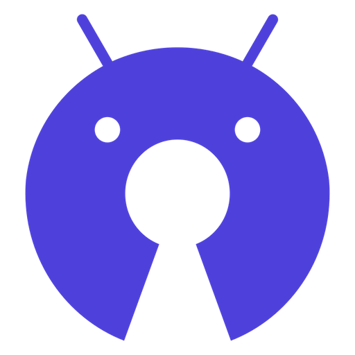

  
  <h2 align="center"><a href="https://www.openapk.net">OpenAPK</a></h2>
  
A curated list of awesome open source apps and games for Android. Updated daily!

### [Popular](#popular) &nbsp;&middot;&nbsp; [New](#new) &nbsp;&middot;&nbsp; [Updated](#updated) &nbsp;&middot;&nbsp; [Featured](#featured)

> [!TIP]
> To get your app listed, open an issue mentioning your repo !
> 
> Use our download banner in your repo readme !
> 
> 

## Categories
- [Connectivity](categories/connectivity.md)
- [Development](categories/development.md)
- [Food](categories/food.md)
- [Games](categories/games.md)
- [Graphics](categories/graphics.md)
- [Internet](categories/internet.md)
- [Messaging](categories/messaging.md)
- [Money](categories/money.md)
- [Office](categories/office.md)
- [Multimedia](categories/multimedia.md)
- [Navigation](categories/navigation.md)
- [Phone & SMS](categories/phone-and-sms.md)
- [Reading](categories/reading.md)
- [Religion](categories/religion.md)
- [Science & Education](categories/science-and-education.md)
- [Security](categories/security.md)
- [Sports & Health](categories/sports-and-health.md)
- [System](categories/system.md)
- [Theming](categories/theming.md)
- [Time](categories/time.md)
- [Writing](categories/writing.md)
- [Xposed](categories/xposed.md)

## New

| App | Info |
| :--- | :--- |
|  | <a href="https://www.openapk.net/v2rayng/com.v2ray.ang/"><b>v2rayNG</b></a> v2ray Android client for VPN and proxy connections <a href="https://github.com/2dust/v2rayNG">Repo</a> &nbsp;&middot;&nbsp; <a href="https://www.openapk.net/v2rayng/com.v2ray.ang/apk/download">↓Download</a> &nbsp;&middot;&nbsp; by <a href="https://github.com/2dust">@2dust</a>|
|  | <a href="https://www.openapk.net/chemsearch/com.furthersecrets.chemsearch/"><b>ChemSearch</b></a> Search any compound and instantly get chemical data from PubChem, 3D models, GHS safety data, elemental analysis & optional AI descriptions. <a href="https://github.com/FurtherSecrets24680/chemsearch-android">Repo</a> &nbsp;&middot;&nbsp; <a href="https://www.openapk.net/chemsearch/com.furthersecrets.chemsearch/apk/download">↓Download</a> &nbsp;&middot;&nbsp; by <a href="https://github.com/FurtherSecrets24680">@FurtherSecrets24680</a>|
|  | <a href="https://www.openapk.net/lichess/org.lichess.mobileV2/"><b>Lichess</b></a> The one open-source chess game <a href="https://github.com/lichess-org/mobile">Repo</a> &nbsp;&middot;&nbsp; <a href="https://www.openapk.net/lichess/org.lichess.mobileV2/apk/download">↓Download</a> &nbsp;&middot;&nbsp; by <a href="https://github.com/lichess-org">@lichess.org</a>|
|  | <a href="https://www.openapk.net/librefit/org.librefit.app/"><b>LibreFit</b></a> Free, open source and private workout tracker with a rich dataset and images. <a href="https://github.com/LibreFitOrg/LibreFit">Repo</a> &nbsp;&middot;&nbsp; <a href="https://www.openapk.net/librefit/org.librefit.app/apk/download">↓Download</a> &nbsp;&middot;&nbsp; by <a href="https://github.com/LibreFitOrg">@IamDg & LibreFit's Contributors</a>|
|  | <a href="https://www.openapk.net/usb-descriptor-explorer/org.kaijinlab.usbdevinfo/"><b>USB Descriptor Explorer</b></a> Inspect USB devices with full descriptor and HID details <a href="https://github.com/iodn/android-usb-device-info">Repo</a> &nbsp;&middot;&nbsp; <a href="https://www.openapk.net/usb-descriptor-explorer/org.kaijinlab.usbdevinfo/apk/download">↓Download</a> &nbsp;&middot;&nbsp; by <a href="https://github.com/iodn">@Samy Younsi (KaijinLab/NSLabs)</a>|
|  | <a href="https://www.openapk.net/rowmate/org.eagsoftware.rowmate/"><b>RowMate</b></a> Track your workouts on your FTMS rowing machine with real-time data. <a href="https://codeberg.org/minardil/RowMate">Repo</a> &nbsp;&middot;&nbsp; <a href="https://www.openapk.net/rowmate/org.eagsoftware.rowmate/apk/download">↓Download</a>|
|  | <a href="https://www.openapk.net/word-tracer/com.wordtracer.app/"><b>Word Tracer</b></a> A crossword-like puzzle game <a href="https://github.com/plhosk/wordtracer">Repo</a> &nbsp;&middot;&nbsp; <a href="https://www.openapk.net/word-tracer/com.wordtracer.app/apk/download">↓Download</a> &nbsp;&middot;&nbsp; by <a href="https://github.com/plhosk">@Paul Hoskinson</a>|
|  | <a href="https://www.openapk.net/calculator-m3/com.vagujhelyigergely.calculatorm3/"><b>Calculator M3</b></a> Clean, private calculator with zero data collection. Offline. No ads. <a href="https://github.com/gergelyvagujhelyi/CalculatorM3">Repo</a> &nbsp;&middot;&nbsp; <a href="https://www.openapk.net/calculator-m3/com.vagujhelyigergely.calculatorm3/apk/download">↓Download</a> &nbsp;&middot;&nbsp; by <a href="https://github.com/gergelyvagujhelyi">@Gergely Vagujhelyi</a>|
|  | <a href="https://www.openapk.net/chibe/com.jmstudios.chibe/"><b>Chibe</b></a> Vibrates to remind you of the time <a href="https://github.com/raatmarien/chibe">Repo</a> &nbsp;&middot;&nbsp; <a href="https://www.openapk.net/chibe/com.jmstudios.chibe/apk/download">↓Download</a> &nbsp;&middot;&nbsp; by <a href="https://github.com/raatmarien">@raatmarien</a>|
|  | <a href="https://www.openapk.net/smart-edge-sidebar-gestures/com.imi.smartedge.sidebar.panel/"><b>Smart Edge: Sidebar & Gestures</b></a> A highly customizable Android side panel inspired by OriginOS. <a href="https://github.com/Imtiaz-Official/Smart-Edge">Repo</a> &nbsp;&middot;&nbsp; <a href="https://www.openapk.net/smart-edge-sidebar-gestures/com.imi.smartedge.sidebar.panel/apk/download">↓Download</a> &nbsp;&middot;&nbsp; by <a href="https://github.com/Imtiaz-Official">@Imtiaz</a>|
|  | <a href="https://www.openapk.net/gifboard/com.gifboard/"><b>GifBoard</b></a> Search and share GIFs directly from your keyboard. <a href="https://github.com/gifboard/gifboard">Repo</a> &nbsp;&middot;&nbsp; <a href="https://www.openapk.net/gifboard/com.gifboard/apk/download">↓Download</a> &nbsp;&middot;&nbsp; by <a href="https://github.com/gifboard">@gifboard</a>|
|  | <a href="https://www.openapk.net/spacebeam/com.calmyjane.spacebeam/"><b>SpaceBeam</b></a> Kaleidoscope Camera Fun! <a href="https://github.com/calmyjane/spacebeam">Repo</a> &nbsp;&middot;&nbsp; <a href="https://www.openapk.net/spacebeam/com.calmyjane.spacebeam/apk/download">↓Download</a> &nbsp;&middot;&nbsp; by <a href="https://github.com/calmyjane">@calmyjane</a>|
|  | <a href="https://www.openapk.net/prism/app.lonecloud.prism/"><b>Prism</b></a> Privacy-first UnifiedPush distributor with an optional self-hosted server <a href="https://github.com/lone-cloud/prism-android">Repo</a> &nbsp;&middot;&nbsp; <a href="https://www.openapk.net/prism/app.lonecloud.prism/apk/download">↓Download</a> &nbsp;&middot;&nbsp; by <a href="https://github.com/lone-cloud">@lone-cloud</a>|
|  | <a href="https://www.openapk.net/numerus/xyz.numerus/"><b>Numerus</b></a> Train oral comprehension of numbers in foreign languages with real speech clips. <a href="https://github.com/konverner/numerus-app">Repo</a> &nbsp;&middot;&nbsp; <a href="https://www.openapk.net/numerus/xyz.numerus/apk/download">↓Download</a> &nbsp;&middot;&nbsp; by <a href="https://github.com/konverner">@Konstantin VERNER</a>|
|  | <a href="https://www.openapk.net/nontrinsic/xyz.linerly.nontrinsic/"><b>Nontrinsic</b></a> Where nonsense lives on. <a href="https://codeberg.org/nontrinsic/android">Repo</a> &nbsp;&middot;&nbsp; <a href="https://www.openapk.net/nontrinsic/xyz.linerly.nontrinsic/apk/download">↓Download</a>|
|  | <a href="https://www.openapk.net/haven-ssh-client/sh.haven.app/"><b>Haven SSH Client</b></a> Secure SSH terminal, VNC desktop, and SFTP client for Android <a href="https://github.com/GlassOnTin/Haven">Repo</a> &nbsp;&middot;&nbsp; <a href="https://www.openapk.net/haven-ssh-client/sh.haven.app/apk/download">↓Download</a> &nbsp;&middot;&nbsp; by <a href="https://github.com/GlassOnTin">@GlassOnTin</a>|
|  | <a href="https://www.openapk.net/fairphone-moments/org.thayyil.spring.launcher/"><b>Fairphone Moments</b></a> Fairphone Moments a minimalist way to use your phone with less distraction. <a href="https://github.com/althafvly/fairphone-moments">Repo</a> &nbsp;&middot;&nbsp; <a href="https://www.openapk.net/fairphone-moments/org.thayyil.spring.launcher/apk/download">↓Download</a> &nbsp;&middot;&nbsp; by <a href="https://github.com/althafvly">@althafvly</a>|
|  | <a href="https://www.openapk.net/tapducky/org.kaijinlab.tap_ducky/"><b>TapDucky</b></a> Run DuckyScript over USB HID. Import, schedule, and manage payloads (root) <a href="https://github.com/iodn/tap-ducky">Repo</a> &nbsp;&middot;&nbsp; <a href="https://www.openapk.net/tapducky/org.kaijinlab.tap_ducky/apk/download">↓Download</a> &nbsp;&middot;&nbsp; by <a href="https://github.com/iodn">@NeroTeam - KaijinLab</a>|
|  | <a href="https://www.openapk.net/golden-ticket/org.golden_ticket.golden_ticket/"><b>Golden Ticket</b></a> Lottery simulation game - explore strategies without spending money <a href="https://gitlab.com/number-smithy/golden-ticket">Repo</a> &nbsp;&middot;&nbsp; <a href="https://www.openapk.net/golden-ticket/org.golden_ticket.golden_ticket/apk/download">↓Download</a> &nbsp;&middot;&nbsp; by <a href="https://gitlab.com/number-smithy">@Jayotis</a>|
|  | <a href="https://www.openapk.net/finalrozgamenew/org.codeberg.rozworld.finalrozgamenew/"><b>FinalRozGameNew</b></a> A pixel art 2D speedrun platformer featuring 17 levels and isometric mechanics. <a href="https://codeberg.org/rozworld/final-roz-game-new">Repo</a> &nbsp;&middot;&nbsp; <a href="https://www.openapk.net/finalrozgamenew/org.codeberg.rozworld.finalrozgamenew/apk/download">↓Download</a>|

## Updated

| App | Info |
| :--- | :--- |
|  | <a href="https://www.openapk.net/litube/com.hhst.litube/"><b>litube</b></a> a feature-rich Android WebView wrapper for YouTube <a href="https://github.com/HydeYYHH/litube">Repo</a> &nbsp;&middot;&nbsp; <a href="https://www.openapk.net/litube/com.hhst.litube/apk/download">↓Download</a> &nbsp;&middot;&nbsp; by <a href="https://github.com/HydeYYHH">@HydeYYHH</a>|
|  | <a href="https://www.openapk.net/feedtv/org.juanro.feedtv/"><b>FeedTV</b></a> read news from any media via RSS and watch public TV channels anywhere <a href="https://github.com/juanro49/FeedTV">Repo</a> &nbsp;&middot;&nbsp; <a href="https://www.openapk.net/feedtv/org.juanro.feedtv/apk/download">↓Download</a> &nbsp;&middot;&nbsp; by <a href="https://github.com/juanro49">@Juanro49</a>|
|  | <a href="https://www.openapk.net/urn/com.illiouchine.jm/"><b>Urn</b></a> A mobile, offline urn for majority judgment polls <a href="https://github.com/MieuxVoter/majority-judgment-offline-urn-android">Repo</a> &nbsp;&middot;&nbsp; <a href="https://www.openapk.net/urn/com.illiouchine.jm/apk/download">↓Download</a> &nbsp;&middot;&nbsp; by <a href="https://github.com/MieuxVoter">@Illiouchine, domi41, MieuxVoter</a>|
|  | <a href="https://www.openapk.net/32steps/com.thirtytwo.steps/"><b>32steps</b></a> Custom volume steps and headphone sound profiles for Android <a href="https://github.com/nulldio/32steps">Repo</a> &nbsp;&middot;&nbsp; <a href="https://www.openapk.net/32steps/com.thirtytwo.steps/apk/download">↓Download</a> &nbsp;&middot;&nbsp; by <a href="https://github.com/nulldio">@nulldio</a>|
|  | <a href="https://www.openapk.net/readest/com.bilingify.readest/"><b>Readest</b></a> ebook reader with powerful features and an intuitive interface <a href="https://github.com/readest/readest">Repo</a> &nbsp;&middot;&nbsp; <a href="https://www.openapk.net/readest/com.bilingify.readest/apk/download">↓Download</a> &nbsp;&middot;&nbsp; by <a href="https://github.com/readest">@Readest</a>|
|  | <a href="https://www.openapk.net/unciv/com.unciv.app/"><b>Unciv</b></a> 4X civilization-building game <a href="https://github.com/yairm210/Unciv">Repo</a> &nbsp;&middot;&nbsp; <a href="https://www.openapk.net/unciv/com.unciv.app/apk/download">↓Download</a> &nbsp;&middot;&nbsp; by <a href="https://github.com/yairm210">@Yair Morgenstern</a>|
|  | <a href="https://www.openapk.net/ampersand/moe.ampersand.app/"><b>Ampersand</b></a> Track who's fronting <a href="https://github.com/NyaomiDEV/Ampersand">Repo</a> &nbsp;&middot;&nbsp; <a href="https://www.openapk.net/ampersand/moe.ampersand.app/apk/download">↓Download</a> &nbsp;&middot;&nbsp; by <a href="https://github.com/NyaomiDEV">@NyaomiDEV</a>|
|  | <a href="https://www.openapk.net/riplay/it.fast4x.riplay/"><b>RiPlay</b></a> Multiplatform Music Player <a href="https://github.com/fast4x/RiPlay">Repo</a> &nbsp;&middot;&nbsp; <a href="https://www.openapk.net/riplay/it.fast4x.riplay/apk/download">↓Download</a> &nbsp;&middot;&nbsp; by <a href="https://github.com/fast4x">@Fast4x</a>|
|  | <a href="https://www.openapk.net/simplex-chat/chat.simplex.app/"><b>SimpleX Chat</b></a> e2e encrypted messenger without any user IDs - private by design! <a href="https://github.com/simplex-chat/simplex-chat">Repo</a> &nbsp;&middot;&nbsp; <a href="https://www.openapk.net/simplex-chat/chat.simplex.app/apk/download">↓Download</a> &nbsp;&middot;&nbsp; by <a href="https://github.com/simplex-chat">@simplex-chat</a>|
|  | <a href="https://www.openapk.net/podcini-x-podcast-instrument/ac.mdiq.podcini.X/"><b>Podcini.X - Podcast instrument</b></a> Modern, feature-rich, without access to Youtube <a href="https://github.com/XilinJia/Podcini.X">Repo</a> &nbsp;&middot;&nbsp; <a href="https://www.openapk.net/podcini-x-podcast-instrument/ac.mdiq.podcini.X/apk/download">↓Download</a> &nbsp;&middot;&nbsp; by <a href="https://github.com/XilinJia">@Xilin Jia</a>|
|  | <a href="https://www.openapk.net/sambalite/de.schliweb.sambalite/"><b>SambaLite</b></a> A lightweight, modern, and open-source Android client for SMB/CIFS shares. <a href="https://github.com/egdels/SambaLite">Repo</a> &nbsp;&middot;&nbsp; <a href="https://www.openapk.net/sambalite/de.schliweb.sambalite/apk/download">↓Download</a> &nbsp;&middot;&nbsp; by <a href="https://github.com/egdels">@egdels</a>|
|  | <a href="https://www.openapk.net/squawker/org.ca.squawker/"><b>Squawker</b></a> An open-source anonymous Twitter client <a href="https://github.com/j-fbriere/squawker">Repo</a> &nbsp;&middot;&nbsp; <a href="https://www.openapk.net/squawker/org.ca.squawker/apk/download">↓Download</a> &nbsp;&middot;&nbsp; by <a href="https://github.com/j-fbriere">@Jean-Francois Briere</a>|
|  | <a href="https://www.openapk.net/grit/com.shub39.grit/"><b>Grit</b></a> A ToDo List and Habit Tracker app that helps you visualise your progress <a href="https://github.com/shub39/Grit">Repo</a> &nbsp;&middot;&nbsp; <a href="https://www.openapk.net/grit/com.shub39.grit/apk/download">↓Download</a> &nbsp;&middot;&nbsp; by <a href="https://github.com/shub39">@Shubham</a>|
|  | <a href="https://www.openapk.net/cuscon/com.froxot.cuscon.foss/"><b>Cuscon</b></a> Icon pack with varied shapes <a href="https://github.com/MiepHD/cuscon">Repo</a> &nbsp;&middot;&nbsp; <a href="https://www.openapk.net/cuscon/com.froxot.cuscon.foss/apk/download">↓Download</a> &nbsp;&middot;&nbsp; by <a href="https://github.com/MiepHD">@MiepHD</a>|
|  | <a href="https://www.openapk.net/nova-video-player/org.courville.nova/"><b>Nova Video Player</b></a> Video player for local/network content with subtitle/metadata download support <a href="https://github.com/nova-video-player/aos-AVP">Repo</a> &nbsp;&middot;&nbsp; <a href="https://www.openapk.net/nova-video-player/org.courville.nova/apk/download">↓Download</a> &nbsp;&middot;&nbsp; by <a href="https://github.com/nova-video-player">@nova-video-player</a>|
|  | <a href="https://www.openapk.net/nerdcalci/com.vishaltelangre.nerdcalci/"><b>NerdCalci</b></a> Calculator for nerds with variables, syntax highlighting, and file sessions <a href="https://github.com/vishaltelangre/NerdCalci">Repo</a> &nbsp;&middot;&nbsp; <a href="https://www.openapk.net/nerdcalci/com.vishaltelangre.nerdcalci/apk/download">↓Download</a> &nbsp;&middot;&nbsp; by <a href="https://github.com/vishaltelangre">@Vishal Telangre</a>|
|  | <a href="https://www.openapk.net/keep-it-up/net.ibbaa.keepitup/"><b>Keep it up</b></a> Simple network monitoring <a href="https://github.com/ibbaa/keepitup">Repo</a> &nbsp;&middot;&nbsp; <a href="https://www.openapk.net/keep-it-up/net.ibbaa.keepitup/apk/download">↓Download</a> &nbsp;&middot;&nbsp; by <a href="https://github.com/ibbaa">@Alwin Ibba</a>|
|  | <a href="https://www.openapk.net/mock-my-gps/com.github.warren_bank.mock_location/"><b>Mock my GPS</b></a> mock the GPS and Network location providers <a href="https://github.com/warren-bank/Android-Mock-Location">Repo</a> &nbsp;&middot;&nbsp; <a href="https://www.openapk.net/mock-my-gps/com.github.warren_bank.mock_location/apk/download">↓Download</a> &nbsp;&middot;&nbsp; by <a href="https://github.com/warren-bank">@Warren Bank</a>|
|  | <a href="https://www.openapk.net/coreply/app.coreply.coreplyapp/"><b>coreply</b></a> Auto-fill suggestions while typing in text messangers <a href="https://github.com/coreply/coreply">Repo</a> &nbsp;&middot;&nbsp; <a href="https://www.openapk.net/coreply/app.coreply.coreplyapp/apk/download">↓Download</a> &nbsp;&middot;&nbsp; by <a href="https://github.com/coreply">@coreply</a>|
|  | <a href="https://www.openapk.net/nora/jp.nonbili.nora/"><b>Nora</b></a> Facebook, Instagram, Reddit, Threads and X in a single app. No ads. <a href="https://github.com/nonbili/Nora">Repo</a> &nbsp;&middot;&nbsp; <a href="https://www.openapk.net/nora/jp.nonbili.nora/apk/download">↓Download</a> &nbsp;&middot;&nbsp; by <a href="https://github.com/nonbili">@nonbili</a>|
|  | <a href="https://www.openapk.net/kai/com.inspiredandroid.kai/"><b>Kai</b></a> Powerful Conversational AI <a href="https://github.com/SimonSchubert/Kai">Repo</a> &nbsp;&middot;&nbsp; <a href="https://www.openapk.net/kai/com.inspiredandroid.kai/apk/download">↓Download</a> &nbsp;&middot;&nbsp; by <a href="https://github.com/SimonSchubert">@Simon Schubert</a>|
|  | <a href="https://www.openapk.net/floccus-bookmark-sync/org.handmadeideas.floccus/"><b>floccus bookmark sync</b></a> Sync your bookmarks privately across browsers and devices <a href="https://github.com/floccusaddon/floccus">Repo</a> &nbsp;&middot;&nbsp; <a href="https://www.openapk.net/floccus-bookmark-sync/org.handmadeideas.floccus/apk/download">↓Download</a> &nbsp;&middot;&nbsp; by <a href="https://github.com/floccusaddon">@Marcel Klehr</a>|
|  | <a href="https://www.openapk.net/freetubecordova/io.freetubeapp.freetube/"><b>FreeTubeCordova</b></a> An open source YouTube player built with privacy in mind <a href="https://github.com/MarmadileManteater/FreeTubeAndroid">Repo</a> &nbsp;&middot;&nbsp; <a href="https://www.openapk.net/freetubecordova/io.freetubeapp.freetube/apk/download">↓Download</a> &nbsp;&middot;&nbsp; by <a href="https://github.com/MarmadileManteater">@MarmadileManteater</a>|
|  | <a href="https://www.openapk.net/nextcloud-news/de.luhmer.owncloudnewsreader/"><b>Nextcloud News</b></a> Android App for Nextcloud News <a href="https://github.com/nextcloud/news-android">Repo</a> &nbsp;&middot;&nbsp; <a href="https://www.openapk.net/nextcloud-news/de.luhmer.owncloudnewsreader/apk/download">↓Download</a> &nbsp;&middot;&nbsp; by <a href="https://github.com/nextcloud">@nextcloud</a>|
|  | <a href="https://www.openapk.net/vpnhood-client/com.vpnhood.client.android.web/"><b>VpnHood</b></a> Undetectable Fast VPN <a href="https://github.com/vpnhood/VpnHood">Repo</a> &nbsp;&middot;&nbsp; <a href="https://www.openapk.net/vpnhood-client/com.vpnhood.client.android.web/apk/download">↓Download</a> &nbsp;&middot;&nbsp; by <a href="https://github.com/vpnhood">@VpnHood</a>|
|  | <a href="https://www.openapk.net/oss-document-scanner/com.akylas.documentscanner/"><b>OSS Document Scanner</b></a> scan all your documents <a href="https://github.com/Akylas/OSS-DocumentScanner">Repo</a> &nbsp;&middot;&nbsp; <a href="https://www.openapk.net/oss-document-scanner/com.akylas.documentscanner/apk/download">↓Download</a> &nbsp;&middot;&nbsp; by <a href="https://github.com/Akylas">@Akylas</a>|
|  | <a href="https://www.openapk.net/stocks-widget/com.github.premnirmal.tickerwidget/"><b>Stocks Widget</b></a> Stock market ticker widget <a href="https://github.com/premnirmal/StockTicker">Repo</a> &nbsp;&middot;&nbsp; <a href="https://www.openapk.net/stocks-widget/com.github.premnirmal.tickerwidget/apk/download">↓Download</a> &nbsp;&middot;&nbsp; by <a href="https://github.com/premnirmal">@Prem Nirmal</a>|
|  | <a href="https://www.openapk.net/rush/com.shub39.rush/"><b>Rush</b></a> App to search, view, save and share lyrics like spotify! <a href="https://github.com/shub39/Rush">Repo</a> &nbsp;&middot;&nbsp; <a href="https://www.openapk.net/rush/com.shub39.rush/apk/download">↓Download</a> &nbsp;&middot;&nbsp; by <a href="https://github.com/shub39">@Shubham</a>|
|  | <a href="https://www.openapk.net/pure-link-url-sanitizer/com.ahmedsamy.purelink/"><b>Pure Link: URL Sanitizer</b></a> Remove tracking from URLs, expand short links & protect privacy <a href="https://github.com/ahmedthebest31/PureLink-Android">Repo</a> &nbsp;&middot;&nbsp; <a href="https://www.openapk.net/pure-link-url-sanitizer/com.ahmedsamy.purelink/apk/download">↓Download</a> &nbsp;&middot;&nbsp; by <a href="https://github.com/ahmedthebest31">@Ahmed Samy El-khouly</a>|
|  | <a href="https://www.openapk.net/fokus-launcher/io.github.luantak.fokuslauncher/"><b>Fokus Launcher</b></a> Minimal launcher with clock, weather, fast app search, and gesture navigation. <a href="https://github.com/luantak/FokusLauncher">Repo</a> &nbsp;&middot;&nbsp; <a href="https://www.openapk.net/fokus-launcher/io.github.luantak.fokuslauncher/apk/download">↓Download</a> &nbsp;&middot;&nbsp; by <a href="https://github.com/luantak">@Paul Scheduikat</a>|

## Popular

| App | Info |
| :--- | :--- |
|  | <a href="https://www.openapk.net/magisk/com.topjohnwu.magisk/"><b>Magisk</b></a> The Magic Mask provides root access and additional modules to further enhance your device. <a href="https://github.com/topjohnwu/Magisk">Repo</a> &nbsp;&middot;&nbsp; <a href="https://www.openapk.net/magisk/com.topjohnwu.magisk/apk/download">↓Download</a> &nbsp;&middot;&nbsp; by <a href="https://github.com/topjohnwu">@John Wu</a>|
|  | <a href="https://www.openapk.net/newpipe/org.schabi.newpipe/"><b>NewPipe</b></a> Lightweight app that lets you watch and listen to media from various platforms. <a href="https://github.com/TeamNewPipe/NewPipe">Repo</a> &nbsp;&middot;&nbsp; <a href="https://www.openapk.net/newpipe/org.schabi.newpipe/apk/download">↓Download</a> &nbsp;&middot;&nbsp; by <a href="https://github.com/TeamNewPipe">@Team NewPipe</a>|
|  | <a href="https://www.openapk.net/clashmetaforandroid/com.github.metacubex.clash.meta/"><b>ClashMetaForAndroid</b></a> A rule-based tunnel <a href="https://github.com/MetaCubeX/ClashMetaForAndroid">Repo</a> &nbsp;&middot;&nbsp; <a href="https://www.openapk.net/clashmetaforandroid/com.github.metacubex.clash.meta/apk/download">↓Download</a> &nbsp;&middot;&nbsp; by <a href="https://github.com/MetaCubeX">@MetaCubeX</a>|
|  | <a href="https://www.openapk.net/kernelsu/me.weishu.kernelsu/"><b>KernelSU</b></a> Kernel based root solution for Android <a href="https://github.com/tiann/KernelSU">Repo</a> &nbsp;&middot;&nbsp; <a href="https://www.openapk.net/kernelsu/me.weishu.kernelsu/apk/download">↓Download</a> &nbsp;&middot;&nbsp; by <a href="https://github.com/tiann">@weishu</a>|
|  | <a href="https://www.openapk.net/spotube/oss.krtirtho.spotube/"><b>Spotube</b></a> Lightweight & resource friendly Spotify client without requiring Spotify Premium <a href="https://github.com/KRTirtho/spotube">Repo</a> &nbsp;&middot;&nbsp; <a href="https://www.openapk.net/spotube/oss.krtirtho.spotube/apk/download">↓Download</a> &nbsp;&middot;&nbsp; by <a href="https://github.com/KRTirtho">@Kingkor Roy Tirtho</a>|
|  | <a href="https://www.openapk.net/ytdlnis/com.deniscerri.ytdl/"><b>YTDLnis</b></a> Android Video/Audio Downloader app using yt-dlp <a href="https://github.com/deniscerri/ytdlnis">Repo</a> &nbsp;&middot;&nbsp; <a href="https://www.openapk.net/ytdlnis/com.deniscerri.ytdl/apk/download">↓Download</a> &nbsp;&middot;&nbsp; by <a href="https://github.com/deniscerri">@deniscerri</a>|
|  | <a href="https://www.openapk.net/v2rayng/com.v2ray.ang/"><b>v2rayNG</b></a> v2ray Android client for VPN and proxy connections <a href="https://github.com/2dust/v2rayNG">Repo</a> &nbsp;&middot;&nbsp; <a href="https://www.openapk.net/v2rayng/com.v2ray.ang/apk/download">↓Download</a> &nbsp;&middot;&nbsp; by <a href="https://github.com/2dust">@2dust</a>|
|  | <a href="https://www.openapk.net/rustdesk/com.carriez.flutter_hbb/"><b>RustDesk</b></a> An open-source remote desktop application, the open source TeamViewer alternative <a href="https://github.com/rustdesk/rustdesk">Repo</a> &nbsp;&middot;&nbsp; <a href="https://www.openapk.net/rustdesk/com.carriez.flutter_hbb/apk/download">↓Download</a> &nbsp;&middot;&nbsp; by <a href="https://github.com/rustdesk">@rustdesk</a>|
|  | <a href="https://www.openapk.net/torrserve/ru.yourok.torrserve/"><b>TorrServe</b></a> Download torrent files <a href="https://github.com/YouROK/TorrServe">Repo</a> &nbsp;&middot;&nbsp; <a href="https://www.openapk.net/torrserve/ru.yourok.torrserve/apk/download">↓Download</a> &nbsp;&middot;&nbsp; by <a href="https://github.com/YouROK">@YouROK</a>|
|  | <a href="https://www.openapk.net/simpmusic/com.maxrave.simpmusic/"><b>SimpMusic</b></a> A music app using YouTube Music for backend <a href="https://github.com/maxrave-dev/SimpMusic">Repo</a> &nbsp;&middot;&nbsp; <a href="https://www.openapk.net/simpmusic/com.maxrave.simpmusic/apk/download">↓Download</a> &nbsp;&middot;&nbsp; by <a href="https://github.com/maxrave-dev">@Nguyễn Đức Tuấn Minh</a>|
|  | <a href="https://www.openapk.net/obtainium/dev.imranr.obtainium/"><b>Obtainium</b></a> Get android app updates directly from the source <a href="https://github.com/ImranR98/Obtainium">Repo</a> &nbsp;&middot;&nbsp; <a href="https://www.openapk.net/obtainium/dev.imranr.obtainium/apk/download">↓Download</a> &nbsp;&middot;&nbsp; by <a href="https://github.com/ImranR98">@Imran Remtulla</a>|
|  | <a href="https://www.openapk.net/nekobox/moe.nb4a/"><b>NekoBox</b></a> sing-box / universal proxy toolchain for Android <a href="https://github.com/MatsuriDayo/NekoBoxForAndroid">Repo</a> &nbsp;&middot;&nbsp; <a href="https://www.openapk.net/nekobox/moe.nb4a/apk/download">↓Download</a> &nbsp;&middot;&nbsp; by <a href="https://github.com/MatsuriDayo">@Leeroy Makubaro</a>|
|  | <a href="https://www.openapk.net/animepipe/InfinityLoop1309.NewPipeEnhanced/"><b>PipePipe</b></a> An alternative Android streaming front-end of Bilibili, NicoNico, Youtube & more <a href="https://github.com/InfinityLoop1308/PipePipe">Repo</a> &nbsp;&middot;&nbsp; <a href="https://www.openapk.net/animepipe/InfinityLoop1309.NewPipeEnhanced/apk/download">↓Download</a> &nbsp;&middot;&nbsp; by <a href="https://github.com/InfinityLoop1308">@NullPointerException</a>|
|  | <a href="https://www.openapk.net/aurora-store/com.aurora.store/"><b>Aurora Store</b></a> An open-source alternative to Google Play Store with privacy and modern design <a href="https://gitlab.com/AuroraOSS/AuroraStore">Repo</a> &nbsp;&middot;&nbsp; <a href="https://www.openapk.net/aurora-store/com.aurora.store/apk/download">↓Download</a> &nbsp;&middot;&nbsp; by <a href="https://gitlab.com/AuroraOSS">@Rahul Kumar Patel</a>|
|  | <a href="https://www.openapk.net/davx/at.bitfire.davdroid/"><b>DAVx⁵</b></a> CalDAV/CardDAV Synchronization and Client <a href="https://github.com/bitfireAT/davx5-ose/">Repo</a> &nbsp;&middot;&nbsp; <a href="https://www.openapk.net/davx/at.bitfire.davdroid/apk/download">↓Download</a> &nbsp;&middot;&nbsp; by <a href="https://github.com/bitfireAT">@bitfire web engineering</a>|
|  | <a href="https://www.openapk.net/metrolist/com.metrolist.music/"><b>Metrolist</b></a> YouTube Music client for Android <a href="https://github.com/mostafaalagamy/Metrolist">Repo</a> &nbsp;&middot;&nbsp; <a href="https://www.openapk.net/metrolist/com.metrolist.music/apk/download">↓Download</a> &nbsp;&middot;&nbsp; by <a href="https://github.com/mostafaalagamy">@Mo Agamy</a>|
|  | <a href="https://www.openapk.net/protonvpn-secure-and-free-vpn/ch.protonvpn.android/"><b>ProtonVPN - Secure and Free VPN</b></a> Free Swiss VPN with advanced security and privacy features. <a href="https://github.com/ProtonVPN/android-app">Repo</a> &nbsp;&middot;&nbsp; <a href="https://www.openapk.net/protonvpn-secure-and-free-vpn/ch.protonvpn.android/apk/download">↓Download</a> &nbsp;&middot;&nbsp; by <a href="https://github.com/ProtonVPN">@ProtonVPN</a>|
|  | <a href="https://www.openapk.net/organic-maps-offline-hike-bike-gps-navigation/app.organicmaps/"><b>Organic Maps</b></a> Offline Hike, Bike, GPS Navigation for travelers, tourists, cyclists & hikers <a href="https://github.com/organicmaps/organicmaps">Repo</a> &nbsp;&middot;&nbsp; <a href="https://www.openapk.net/organic-maps-offline-hike-bike-gps-navigation/app.organicmaps/apk/download">↓Download</a> &nbsp;&middot;&nbsp; by <a href="https://github.com/organicmaps">@organicmaps</a>|
|  | <a href="https://www.openapk.net/kazumi/com.predidit.kazumi/"><b>Kazumi</b></a> An anime collection app based on custom rules. <a href="https://github.com/Predidit/Kazumi">Repo</a> &nbsp;&middot;&nbsp; <a href="https://www.openapk.net/kazumi/com.predidit.kazumi/apk/download">↓Download</a> &nbsp;&middot;&nbsp; by <a href="https://github.com/Predidit">@Predidit</a>|
|  | <a href="https://www.openapk.net/librera-reader/com.foobnix.pro.pdf.reader/"><b>Librera Reader</b></a> Book and PDF reader <a href="https://github.com/foobnix/LibreraReader">Repo</a> &nbsp;&middot;&nbsp; <a href="https://www.openapk.net/librera-reader/com.foobnix.pro.pdf.reader/apk/download">↓Download</a> &nbsp;&middot;&nbsp; by <a href="https://github.com/foobnix">@Librera</a>|
|  | <a href="https://www.openapk.net/shadowsocks/com.github.shadowsocks/"><b>Shadowsocks</b></a> A shadowsocks client <a href="https://github.com/shadowsocks/shadowsocks-android">Repo</a> &nbsp;&middot;&nbsp; <a href="https://www.openapk.net/shadowsocks/com.github.shadowsocks/apk/download">↓Download</a> &nbsp;&middot;&nbsp; by <a href="https://github.com/shadowsocks">@shadowsocks</a>|
|  | <a href="https://www.openapk.net/droid-ify/com.looker.droidify/"><b>Droid-ify</b></a> Material-ify with Droid-ify. <a href="https://github.com/Droid-ify/client">Repo</a> &nbsp;&middot;&nbsp; <a href="https://www.openapk.net/droid-ify/com.looker.droidify/apk/download">↓Download</a> &nbsp;&middot;&nbsp; by <a href="https://github.com/Droid-ify">@Iamlooker</a>|
|  | <a href="https://www.openapk.net/neo-store/com.machiav3lli.fdroid/"><b>Neo Store</b></a> A modern feature-rich F-Droid client. <a href="https://github.com/NeoApplications/Neo-Store">Repo</a> &nbsp;&middot;&nbsp; <a href="https://www.openapk.net/neo-store/com.machiav3lli.fdroid/apk/download">↓Download</a> &nbsp;&middot;&nbsp; by <a href="https://github.com/NeoApplications">@Antonios Hazim</a>|
|  | <a href="https://www.openapk.net/fossify-gallery/org.fossify.gallery/"><b>Fossify Gallery</b></a> Gallery with Photo editor. No Ads, Open-source, Private. No strings attached. <a href="https://github.com/FossifyOrg/Gallery">Repo</a> &nbsp;&middot;&nbsp; <a href="https://www.openapk.net/fossify-gallery/org.fossify.gallery/apk/download">↓Download</a> &nbsp;&middot;&nbsp; by <a href="https://github.com/FossifyOrg">@Fossify</a>|
|  | <a href="https://www.openapk.net/k-9-mail/com.fsck.k9/"><b>K-9 Mail</b></a> Full-featured email client <a href="https://github.com/thunderbird/thunderbird-android">Repo</a> &nbsp;&middot;&nbsp; <a href="https://www.openapk.net/k-9-mail/com.fsck.k9/apk/download">↓Download</a> &nbsp;&middot;&nbsp; by <a href="https://github.com/thunderbird">@thunderbird</a>|
|  | <a href="https://www.openapk.net/canta/org.samo_lego.canta/"><b>Canta</b></a> Uninstall any system app without root! <a href="https://github.com/samolego/Canta">Repo</a> &nbsp;&middot;&nbsp; <a href="https://www.openapk.net/canta/org.samo_lego.canta/apk/download">↓Download</a> &nbsp;&middot;&nbsp; by <a href="https://github.com/samolego">@samolego</a>|
|  | <a href="https://www.openapk.net/duckduckgo-privacy-browser/com.duckduckgo.mobile.android/"><b>DuckDuckGo Privacy Browser</b></a> Privacy, simplified open source web browser <a href="https://github.com/duckduckgo/Android">Repo</a> &nbsp;&middot;&nbsp; <a href="https://www.openapk.net/duckduckgo-privacy-browser/com.duckduckgo.mobile.android/apk/download">↓Download</a> &nbsp;&middot;&nbsp; by <a href="https://github.com/duckduckgo">@DuckDuckGo</a>|
|  | <a href="https://www.openapk.net/skytube/free.rm.skytube.oss/"><b>SkyTube</b></a> An open source YouTube client <a href="https://github.com/SkyTubeTeam/SkyTube">Repo</a> &nbsp;&middot;&nbsp; <a href="https://www.openapk.net/skytube/free.rm.skytube.oss/apk/download">↓Download</a> &nbsp;&middot;&nbsp; by <a href="https://github.com/SkyTubeTeam">@SkyTubeTeam</a>|
|  | <a href="https://www.openapk.net/breezy-weather/org.breezyweather/"><b>Breezy Weather</b></a> A lightweight, powerful, open-source Material Design weather app. <a href="https://github.com/breezy-weather/breezy-weather">Repo</a> &nbsp;&middot;&nbsp; <a href="https://www.openapk.net/breezy-weather/org.breezyweather/apk/download">↓Download</a> &nbsp;&middot;&nbsp; by <a href="https://github.com/breezy-weather">@Breezy Weather</a>|
|  | <a href="https://www.openapk.net/nextcloud/com.nextcloud.client/"><b>Nextcloud</b></a> Synchronization client <a href="https://github.com/nextcloud/android">Repo</a> &nbsp;&middot;&nbsp; <a href="https://www.openapk.net/nextcloud/com.nextcloud.client/apk/download">↓Download</a> &nbsp;&middot;&nbsp; by <a href="https://github.com/nextcloud">@nextcloud</a>|

## Featured

| App | Info |
| :--- | :--- |
|  | <a href="https://www.openapk.net/daily-you/com.demizo.daily_you/"><b>Daily You</b></a> Log every day and look back on past memories <a href="https://github.com/Demizo/Daily_You">Repo</a> &nbsp;&middot;&nbsp; <a href="https://www.openapk.net/daily-you/com.demizo.daily_you/apk/download">↓Download</a> &nbsp;&middot;&nbsp; by <a href="https://github.com/Demizo">@Demizo</a>|
|  | <a href="https://www.openapk.net/binary-eye/de.markusfisch.android.binaryeye/"><b>Binary Eye</b></a> Yet another barcode scanner <a href="https://github.com/markusfisch/BinaryEye">Repo</a> &nbsp;&middot;&nbsp; <a href="https://www.openapk.net/binary-eye/de.markusfisch.android.binaryeye/apk/download">↓Download</a> &nbsp;&middot;&nbsp; by <a href="https://github.com/markusfisch">@Markus Fisch</a>|
|  | <a href="https://www.openapk.net/fairscan-pdf-scanner/org.fairscan.app/"><b>FairScan - PDF Scanner</b></a> Scan a document and get a clean PDF you can save or share instantly <a href="https://github.com/pynicolas/FairScan">Repo</a> &nbsp;&middot;&nbsp; <a href="https://www.openapk.net/fairscan-pdf-scanner/org.fairscan.app/apk/download">↓Download</a> &nbsp;&middot;&nbsp; by <a href="https://github.com/pynicolas">@pynicolas</a>|
|  | <a href="https://www.openapk.net/bangumi/com.czy0729.bangumi/"><b>Bangumi番组计划</b></a> A third-party client for Bangumi <a href="https://github.com/czy0729/Bangumi">Repo</a> &nbsp;&middot;&nbsp; <a href="https://www.openapk.net/bangumi/com.czy0729.bangumi/apk/download">↓Download</a> &nbsp;&middot;&nbsp; by <a href="https://github.com/czy0729">@Chan</a>|
|  | <a href="https://www.openapk.net/trackercontrol/net.kollnig.missioncontrol/"><b>TrackerControl</b></a> monitor and control hidden data collection in mobile apps <a href="https://github.com/TrackerControl/tracker-control-android">Repo</a> &nbsp;&middot;&nbsp; <a href="https://www.openapk.net/trackercontrol/net.kollnig.missioncontrol/apk/download">↓Download</a> &nbsp;&middot;&nbsp; by <a href="https://github.com/TrackerControl">@TrackerControl</a>|
|  | <a href="https://www.openapk.net/exclave/com.github.dyhkwong.sagernet/"><b>Exclave</b></a> Proxy client <a href="https://github.com/dyhkwong/Exclave">Repo</a> &nbsp;&middot;&nbsp; <a href="https://www.openapk.net/exclave/com.github.dyhkwong.sagernet/apk/download">↓Download</a> &nbsp;&middot;&nbsp; by <a href="https://github.com/dyhkwong">@dyhkwong</a>|
|  | <a href="https://www.openapk.net/bitwarden/com.x8bit.bitwarden/"><b>Bitwarden</b></a> The most trusted password manager <a href="https://github.com/bitwarden/android">Repo</a> &nbsp;&middot;&nbsp; <a href="https://www.openapk.net/bitwarden/com.x8bit.bitwarden/apk/download">↓Download</a> &nbsp;&middot;&nbsp; by <a href="https://github.com/bitwarden">@bitwarden</a>|
|  | <a href="https://www.openapk.net/pixez/com.perol.pixez/"><b>PixEz</b></a> A third-party Pixiv flutter client that supports viewing ugoira <a href="https://github.com/Notsfsssf/pixez-flutter">Repo</a> &nbsp;&middot;&nbsp; <a href="https://www.openapk.net/pixez/com.perol.pixez/apk/download">↓Download</a> &nbsp;&middot;&nbsp; by <a href="https://github.com/Notsfsssf">@Notsfsssf</a>|
|  | <a href="https://www.openapk.net/permission-pilot/eu.darken.myperm/"><b>Permission Pilot</b></a> Android app permission overview <a href="https://github.com/d4rken-org/permission-pilot">Repo</a> &nbsp;&middot;&nbsp; <a href="https://www.openapk.net/permission-pilot/eu.darken.myperm/apk/download">↓Download</a> &nbsp;&middot;&nbsp; by <a href="https://github.com/d4rken-org">@Matthias Urhahn</a>|
|  | <a href="https://www.openapk.net/ente-encrypted-photo-storage/io.ente.photos/"><b>Ente Photos</b></a> ente is an end-to-end encrypted photo storage app <a href="https://github.com/ente-io/ente">Repo</a> &nbsp;&middot;&nbsp; <a href="https://www.openapk.net/ente-encrypted-photo-storage/io.ente.photos/apk/download">↓Download</a> &nbsp;&middot;&nbsp; by <a href="https://github.com/ente-io">@ente</a>|
|  | <a href="https://www.openapk.net/hacki-for-hacker-news/com.jiaqifeng.hacki/"><b>Hacki for Hacker News</b></a> Hacki is a simple noiseless Hacker News client that is just enough. <a href="https://github.com/Livinglist/Hacki">Repo</a> &nbsp;&middot;&nbsp; <a href="https://www.openapk.net/hacki-for-hacker-news/com.jiaqifeng.hacki/apk/download">↓Download</a> &nbsp;&middot;&nbsp; by <a href="https://github.com/Livinglist">@Jiaqi Feng</a>|
|  | <a href="https://www.openapk.net/coffee/com.github.muellerma.coffee/"><b>Coffee</b></a> Keep display awake <a href="https://github.com/mueller-ma/Coffee">Repo</a> &nbsp;&middot;&nbsp; <a href="https://www.openapk.net/coffee/com.github.muellerma.coffee/apk/download">↓Download</a> &nbsp;&middot;&nbsp; by <a href="https://github.com/mueller-ma">@mueller-ma</a>|
|  | <a href="https://www.openapk.net/calcyou/net.youapps.calcyou/"><b>CalcYou</b></a> Privacy Focused Calculator app built with MD3 <a href="https://github.com/you-apps/CalcYou">Repo</a> &nbsp;&middot;&nbsp; <a href="https://www.openapk.net/calcyou/net.youapps.calcyou/apk/download">↓Download</a> &nbsp;&middot;&nbsp; by <a href="https://github.com/you-apps">@You Apps</a>|
|  | <a href="https://www.openapk.net/pocket-casts/au.com.shiftyjelly.pocketcasts/"><b>Pocket Casts</b></a> Podcast Player for Android with advanced listening, search, and discovery features. <a href="https://github.com/Automattic/pocket-casts-android">Repo</a> &nbsp;&middot;&nbsp; <a href="https://www.openapk.net/pocket-casts/au.com.shiftyjelly.pocketcasts/apk/download">↓Download</a> &nbsp;&middot;&nbsp; by <a href="https://github.com/Automattic">@Automattic</a>|
|  | <a href="https://www.openapk.net/material-photo-widget/com.fibelatti.photowidget/"><b>Material Photo Widget</b></a> Photo Widget is a free, no-ads app to display photos on your home screen <a href="https://github.com/fibelatti/photo-widget">Repo</a> &nbsp;&middot;&nbsp; <a href="https://www.openapk.net/material-photo-widget/com.fibelatti.photowidget/apk/download">↓Download</a> &nbsp;&middot;&nbsp; by <a href="https://github.com/fibelatti">@Filipe Belatti</a>|
|  | <a href="https://www.openapk.net/bitchat/com.bitchat.android/"><b>bitchat</b></a> bluetooth mesh chat, Android port of Bitchat <a href="https://github.com/permissionlesstech/bitchat-android">Repo</a> &nbsp;&middot;&nbsp; <a href="https://www.openapk.net/bitchat/com.bitchat.android/apk/download">↓Download</a> &nbsp;&middot;&nbsp; by <a href="https://github.com/permissionlesstech">@permissionlesstech</a>|
|  | <a href="https://www.openapk.net/kreate/me.knighthat.kreate/"><b>Kreate</b></a> A multilingual YouTube Music frontend for Android, prioritize performance <a href="https://github.com/knighthat/Kreate">Repo</a> &nbsp;&middot;&nbsp; <a href="https://www.openapk.net/kreate/me.knighthat.kreate/apk/download">↓Download</a> &nbsp;&middot;&nbsp; by <a href="https://github.com/knighthat">@Knight Hat</a>|
|  | <a href="https://www.openapk.net/celestia/space.celestia.mobilecelestia/"><b>Celestia</b></a> Real-time 3D visualization of space <a href="https://github.com/celestiamobile/AndroidCelestia/">Repo</a> &nbsp;&middot;&nbsp; <a href="https://www.openapk.net/celestia/space.celestia.mobilecelestia/apk/download">↓Download</a> &nbsp;&middot;&nbsp; by <a href="https://github.com/celestiamobile">@Levin Li</a>|
|  | <a href="https://www.openapk.net/offi/de.schildbach.oeffi/"><b>Offi</b></a> King of public transit planning! <a href="https://gitlab.com/oeffi/oeffi">Repo</a> &nbsp;&middot;&nbsp; <a href="https://www.openapk.net/offi/de.schildbach.oeffi/apk/download">↓Download</a> &nbsp;&middot;&nbsp; by <a href="https://gitlab.com/oeffi">@Andreas Schildbach</a>|
|  | <a href="https://www.openapk.net/tailscale/com.tailscale.ipn/"><b>Tailscale</b></a> Mesh VPN based on WireGuard <a href="https://github.com/tailscale/tailscale-android">Repo</a> &nbsp;&middot;&nbsp; <a href="https://www.openapk.net/tailscale/com.tailscale.ipn/apk/download">↓Download</a> &nbsp;&middot;&nbsp; by <a href="https://github.com/tailscale">@tailscale</a>|
