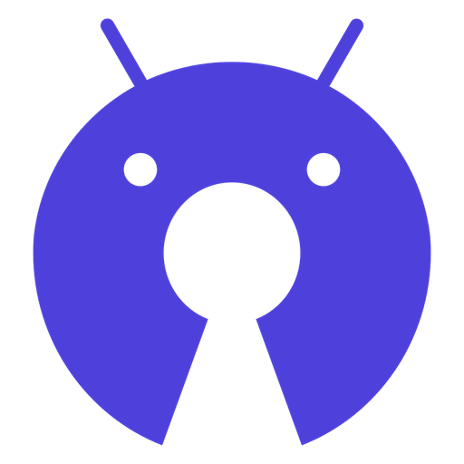

  
  <h2 align="center"><a href="https://www.openapk.net">OpenAPK</a></h2>
  
A curated list of awesome open source apps and games for Android. Updated daily!

### [Popular](#popular) &nbsp;&middot;&nbsp; [New](#new) &nbsp;&middot;&nbsp; [Updated](#updated) &nbsp;&middot;&nbsp; [Featured](#featured)

> [!TIP]
> To get your app listed, open an issue mentioning your repo !
> 
> Use our download banner in your repo readme !
> 
> 

## Categories
- [Connectivity](categories/connectivity.md)
- [Development](categories/development.md)
- [Food](categories/food.md)
- [Games](categories/games.md)
- [Graphics](categories/graphics.md)
- [Internet](categories/internet.md)
- [Messaging](categories/messaging.md)
- [Money](categories/money.md)
- [Office](categories/office.md)
- [Multimedia](categories/multimedia.md)
- [Navigation](categories/navigation.md)
- [Phone & SMS](categories/phone-and-sms.md)
- [Reading](categories/reading.md)
- [Religion](categories/religion.md)
- [Science & Education](categories/science-and-education.md)
- [Security](categories/security.md)
- [Sports & Health](categories/sports-and-health.md)
- [System](categories/system.md)
- [Theming](categories/theming.md)
- [Time](categories/time.md)
- [Writing](categories/writing.md)
- [Xposed](categories/xposed.md)

## New

| App | Info |
| :--- | :--- |
|  | <a href="https://www.openapk.net/snowdrop/site.remlit.snowdrop/"><b>Snowdrop</b></a> Multiplatform Mastodon API client using Compose <a href="https://github.com/ihateblueb/snowdrop">Repo</a> &nbsp;&middot;&nbsp; <a href="https://www.openapk.net/snowdrop/site.remlit.snowdrop/apk/download">↓Download</a> &nbsp;&middot;&nbsp; by <a href="https://github.com/ihateblueb">@Snowdrop Developers</a>|
|  | <a href="https://www.openapk.net/seenema-movie-tracker/sitavi.seenema/"><b>Seenema: Movie Tracker</b></a> Track and rate the films and series you have watched. No account, no ads. <a href="https://github.com/Sitavi/Seenema-movie-tracker">Repo</a> &nbsp;&middot;&nbsp; <a href="https://www.openapk.net/seenema-movie-tracker/sitavi.seenema/apk/download">↓Download</a> &nbsp;&middot;&nbsp; by <a href="https://github.com/Sitavi">@Sitavi</a>|
|  | <a href="https://www.openapk.net/andraw/se.constructions.andraw/"><b>AnDraw</b></a> Trace images through paper with touch switched off <a href="https://github.com/peterhel/andraw">Repo</a> &nbsp;&middot;&nbsp; <a href="https://www.openapk.net/andraw/se.constructions.andraw/apk/download">↓Download</a> &nbsp;&middot;&nbsp; by <a href="https://github.com/peterhel">@Peter Helenefors</a>|
|  | <a href="https://www.openapk.net/xlog2/ro.scripca.xlog2/"><b>xlog2</b></a> Peer-to-peer amateur-radio field logbook that syncs with the xlog2 desktop <a href="https://github.com/yo6ssw/xlog2">Repo</a> &nbsp;&middot;&nbsp; <a href="https://www.openapk.net/xlog2/ro.scripca.xlog2/apk/download">↓Download</a> &nbsp;&middot;&nbsp; by <a href="https://github.com/yo6ssw">@Adrian Scripca</a>|
|  | <a href="https://www.openapk.net/guandan-%E6%8E%BC%E8%8B/page.codeberg.lanticy.guandan/"><b>Guandan 掼蛋</b></a> Guandan card game for four players over local Wi-Fi. No server, no account. <a href="https://codeberg.org/lanticy/guandan">Repo</a> &nbsp;&middot;&nbsp; <a href="https://www.openapk.net/guandan-%E6%8E%BC%E8%8B/page.codeberg.lanticy.guandan/apk/download">↓Download</a>|
|  | <a href="https://www.openapk.net/voxscribe-offline-voice-input/org.y20k.voxscribe/"><b>Voxscribe - Offline Voice Input</b></a> Voxscribe is an offline voice keyboard that transcribes speech on-device. <a href="https://codeberg.org/y20k/voxscribe">Repo</a> &nbsp;&middot;&nbsp; <a href="https://www.openapk.net/voxscribe-offline-voice-input/org.y20k.voxscribe/apk/download">↓Download</a>|
|  | <a href="https://www.openapk.net/scrib/org.scrib.transcriber/"><b>Scrib</b></a> On-device voice transcription. Your audio never leaves your phone. <a href="https://github.com/23rd/Scrib">Repo</a> &nbsp;&middot;&nbsp; <a href="https://www.openapk.net/scrib/org.scrib.transcriber/apk/download">↓Download</a> &nbsp;&middot;&nbsp; by <a href="https://github.com/23rd">@23rd</a>|
|  | <a href="https://www.openapk.net/pitchvis/org.p1graph.pitchvis/"><b>PitchVis</b></a> Real-time visualization of musical pitches from live audio <a href="https://github.com/heinzelotto/pitchvis">Repo</a> &nbsp;&middot;&nbsp; <a href="https://www.openapk.net/pitchvis/org.p1graph.pitchvis/apk/download">↓Download</a> &nbsp;&middot;&nbsp; by <a href="https://github.com/heinzelotto">@Felix Monninger</a>|
|  | <a href="https://www.openapk.net/libreaac/org.libreaac.app/"><b>LibreAAC</b></a> Private, offline AAC communication using open OBF and OBZ boards <a href="https://github.com/libretastic/libreaac-android">Repo</a> &nbsp;&middot;&nbsp; <a href="https://www.openapk.net/libreaac/org.libreaac.app/apk/download">↓Download</a> &nbsp;&middot;&nbsp; by <a href="https://github.com/libretastic">@Luke Howson</a>|
|  | <a href="https://www.openapk.net/neruppu/org.havenapp.neruppu/"><b>Neruppu</b></a> Offline-first physical security monitoring using device sensors <a href="https://github.com/thamizh-root/neruppu">Repo</a> &nbsp;&middot;&nbsp; <a href="https://www.openapk.net/neruppu/org.havenapp.neruppu/apk/download">↓Download</a> &nbsp;&middot;&nbsp; by <a href="https://github.com/thamizh-root">@Thamizharasan Munusamy</a>|
|  | <a href="https://www.openapk.net/openshelf/org.ftena.openshelf/"><b>Openshelf</b></a> Free, open-source personal library manager and book tracker. <a href="https://github.com/Swappppy/Openshelf">Repo</a> &nbsp;&middot;&nbsp; <a href="https://www.openapk.net/openshelf/org.ftena.openshelf/apk/download">↓Download</a> &nbsp;&middot;&nbsp; by <a href="https://github.com/Swappppy">@Swappppy</a>|
|  | <a href="https://www.openapk.net/usagi/org.draken.usagi/"><b>Usagi</b></a> Open-source manga reader for Android <a href="https://github.com/UsagiApp/Usagi">Repo</a> &nbsp;&middot;&nbsp; <a href="https://www.openapk.net/usagi/org.draken.usagi/apk/download">↓Download</a> &nbsp;&middot;&nbsp; by <a href="https://github.com/UsagiApp">@Draken</a>|
|  | <a href="https://www.openapk.net/tane/org.comunes.tane/"><b>Tane</b></a> Your seed bank in your pocket — offline, encrypted, no account. <a href="https://git.comunes.org/comunes/tane">Repo</a> &nbsp;&middot;&nbsp; <a href="https://www.openapk.net/tane/org.comunes.tane/apk/download">↓Download</a>|
|  | <a href="https://www.openapk.net/tubester/org.codeberg.pako.tubester/"><b>Tubester</b></a> Scan Hitster cards and play their songs on YouTube <a href="https://codeberg.org/pako/tubester">Repo</a> &nbsp;&middot;&nbsp; <a href="https://www.openapk.net/tubester/org.codeberg.pako.tubester/apk/download">↓Download</a>|
|  | <a href="https://www.openapk.net/anonomi-messenger/org.anonomi.android/"><b>Anonomi Messenger</b></a> Decentralized messaging for high-threat environments <a href="https://github.com/anonomi-org/anonomi-android">Repo</a> &nbsp;&middot;&nbsp; <a href="https://www.openapk.net/anonomi-messenger/org.anonomi.android/apk/download">↓Download</a> &nbsp;&middot;&nbsp; by <a href="https://github.com/anonomi-org">@anonomi-org</a>|
|  | <a href="https://www.openapk.net/3x-ui-manager/net.yukh.xui/"><b>3X-UI Manager</b></a> Manage your 3x-ui / Xray proxy panels from your phone <a href="https://github.com/yukh975/3X-UI-Manager">Repo</a> &nbsp;&middot;&nbsp; <a href="https://www.openapk.net/3x-ui-manager/net.yukh.xui/apk/download">↓Download</a> &nbsp;&middot;&nbsp; by <a href="https://github.com/yukh975">@Yuriy Khachaturian</a>|
|  | <a href="https://www.openapk.net/currency-converter/net.yukh.currency/"><b>Currency Converter</b></a> CBR & market rates: my currency, favorites, offline cache, daily summary <a href="https://github.com/yukh975/netadm-currency-app">Repo</a> &nbsp;&middot;&nbsp; <a href="https://www.openapk.net/currency-converter/net.yukh.currency/apk/download">↓Download</a> &nbsp;&middot;&nbsp; by <a href="https://github.com/yukh975">@Yuriy Khachaturian</a>|
|  | <a href="https://www.openapk.net/navy-fleet-battle/net.tigr.navyfleetbattle/"><b>Navy Fleet Battle</b></a> The classic Russian sea battle game, for one player or two <a href="https://github.com/tigrino/navy-fleet-battle">Repo</a> &nbsp;&middot;&nbsp; <a href="https://www.openapk.net/navy-fleet-battle/net.tigr.navyfleetbattle/apk/download">↓Download</a> &nbsp;&middot;&nbsp; by <a href="https://github.com/tigrino">@Albert Zenkoff</a>|
|  | <a href="https://www.openapk.net/quiet-rebellion/net.quietrebellion/"><b>Quiet Rebellion</b></a> Control your Bose QC Ultra 2 directly — no Bose app, no cloud, no account. <a href="https://github.com/MadEyez/quietrebellion">Repo</a> &nbsp;&middot;&nbsp; <a href="https://www.openapk.net/quiet-rebellion/net.quietrebellion/apk/download">↓Download</a> &nbsp;&middot;&nbsp; by <a href="https://github.com/MadEyez">@MadEyez</a>|
|  | <a href="https://www.openapk.net/windy-live-wallpaper/net.pgaskin.windy/"><b>Windy Live Wallpaper</b></a> Android live wallpaper visualizing local wind patterns <a href="https://github.com/pgaskin/windy">Repo</a> &nbsp;&middot;&nbsp; <a href="https://www.openapk.net/windy-live-wallpaper/net.pgaskin.windy/apk/download">↓Download</a> &nbsp;&middot;&nbsp; by <a href="https://github.com/pgaskin">@Patrick Gaskin</a>|

## Updated

| App | Info |
| :--- | :--- |
|  | <a href="https://www.openapk.net/atrium/app.atrium/"><b>Atrium</b></a> Control your self-hosted media stack from one app <a href="https://github.com/retransmit/Atrium">Repo</a> &nbsp;&middot;&nbsp; <a href="https://www.openapk.net/atrium/app.atrium/apk/download">↓Download</a> &nbsp;&middot;&nbsp; by <a href="https://github.com/retransmit">@retransmit</a>|
|  | <a href="https://www.openapk.net/remember-notes-reminders/dev.bikram.remember.gh/"><b>Remember: Notes & Reminders</b></a> Notes, tasks, and reminders that keep coming back until they are done. <a href="https://github.com/bikram-agarwal/Remember">Repo</a> &nbsp;&middot;&nbsp; <a href="https://www.openapk.net/remember-notes-reminders/dev.bikram.remember.gh/apk/download">↓Download</a> &nbsp;&middot;&nbsp; by <a href="https://github.com/bikram-agarwal">@Bikram Agarwal</a>|
|  | <a href="https://www.openapk.net/mindwtr/tech.dongdongbh.mindwtr/"><b>Mindwtr</b></a> A complete Getting Things Done (GTD) productivity system. Mind Like Water. <a href="https://github.com/dongdongbh/Mindwtr">Repo</a> &nbsp;&middot;&nbsp; <a href="https://www.openapk.net/mindwtr/tech.dongdongbh.mindwtr/apk/download">↓Download</a> &nbsp;&middot;&nbsp; by <a href="https://github.com/dongdongbh">@Dongda Li</a>|
|  | <a href="https://www.openapk.net/tehran-metro/com.ma.tehro/"><b>Tehran Metro</b></a> An app to facilitate using tehran metro <a href="https://github.com/mosayeb-a/tehran-metro">Repo</a> &nbsp;&middot;&nbsp; <a href="https://www.openapk.net/tehran-metro/com.ma.tehro/apk/download">↓Download</a> &nbsp;&middot;&nbsp; by <a href="https://github.com/mosayeb-a">@mosayeb-a</a>|
|  | <a href="https://www.openapk.net/dobbyvpn/com.dobby.vpn/"><b>DobbyVPN</b></a> VPN client-side toolset. <a href="https://github.com/DobbyVPN/DobbyVPN">Repo</a> &nbsp;&middot;&nbsp; <a href="https://www.openapk.net/dobbyvpn/com.dobby.vpn/apk/download">↓Download</a> &nbsp;&middot;&nbsp; by <a href="https://github.com/DobbyVPN">@DobbyVPN</a>|
|  | <a href="https://www.openapk.net/tsacdop-fork-podcast-player/dev.lojcs.tsacdop/"><b>Tsacdop-Fork - Podcast Player</b></a> Enjoy podcasts with Tsacdop-Fork! A clean, simply beautiful, and friendly app. <a href="https://github.com/lojcs/tsacdop">Repo</a> &nbsp;&middot;&nbsp; <a href="https://www.openapk.net/tsacdop-fork-podcast-player/dev.lojcs.tsacdop/apk/download">↓Download</a> &nbsp;&middot;&nbsp; by <a href="https://github.com/lojcs">@Lojcs</a>|
|  | <a href="https://www.openapk.net/wikipedia/org.wikipedia/"><b>Wikipedia</b></a> Official feature-rich viewer of the free online encyclopedia <a href="https://github.com/wikimedia/apps-android-wikipedia">Repo</a> &nbsp;&middot;&nbsp; <a href="https://www.openapk.net/wikipedia/org.wikipedia/apk/download">↓Download</a> &nbsp;&middot;&nbsp; by <a href="https://github.com/wikimedia">@Wikimedia</a>|
|  | <a href="https://www.openapk.net/quotes-app/com.shalenmathew.quotesapp/"><b>Quotes.app</b></a> A minimalistic quotes app <a href="https://github.com/shalenMathew/Quotes-app">Repo</a> &nbsp;&middot;&nbsp; <a href="https://www.openapk.net/quotes-app/com.shalenmathew.quotesapp/apk/download">↓Download</a> &nbsp;&middot;&nbsp; by <a href="https://github.com/shalenMathew">@Shalen Mathew</a>|
|  | <a href="https://www.openapk.net/pgpony/com.pgpony.android/"><b>PGPony</b></a> OpenPGP encryption with hardware security keys and password-store support <a href="https://github.com/norsehorse-dev/PGPonyAndroid">Repo</a> &nbsp;&middot;&nbsp; <a href="https://www.openapk.net/pgpony/com.pgpony.android/apk/download">↓Download</a> &nbsp;&middot;&nbsp; by <a href="https://github.com/norsehorse-dev">@NorseHorse</a>|
|  | <a href="https://www.openapk.net/airlyrics/com.andsi.airlyrics/"><b>AirLyrics</b></a> Floating synced lyrics for Android <a href="https://github.com/AirLyrics/AirLyrics">Repo</a> &nbsp;&middot;&nbsp; <a href="https://www.openapk.net/airlyrics/com.andsi.airlyrics/apk/download">↓Download</a> &nbsp;&middot;&nbsp; by <a href="https://github.com/AirLyrics">@AndSi</a>|
|  | <a href="https://www.openapk.net/playtube/com.arslandaim.playtube/"><b>PlayTube</b></a> Feature-rich YouTube client, fast and secure with Material 3 design <a href="https://github.com/arslandaim-hub/PlayTube">Repo</a> &nbsp;&middot;&nbsp; <a href="https://www.openapk.net/playtube/com.arslandaim.playtube/apk/download">↓Download</a> &nbsp;&middot;&nbsp; by <a href="https://github.com/arslandaim-hub">@arslandaim</a>|
|  | <a href="https://www.openapk.net/braincup/com.inspiredandroid.braincup/"><b>Braincup</b></a> Train your focus, memory and math skills. <a href="https://github.com/SimonSchubert/Braincup">Repo</a> &nbsp;&middot;&nbsp; <a href="https://www.openapk.net/braincup/com.inspiredandroid.braincup/apk/download">↓Download</a> &nbsp;&middot;&nbsp; by <a href="https://github.com/SimonSchubert">@Simon Schubert</a>|
|  | <a href="https://www.openapk.net/passvault/com.jksalcedo.passvault/"><b>PassVault</b></a> A secure, 100% offline password manager. <a href="https://github.com/jksalcedo/PassVault">Repo</a> &nbsp;&middot;&nbsp; <a href="https://www.openapk.net/passvault/com.jksalcedo.passvault/apk/download">↓Download</a> &nbsp;&middot;&nbsp; by <a href="https://github.com/jksalcedo">@Jaressen Kyle Salcedo</a>|
|  | <a href="https://www.openapk.net/readwide/com.readwide.manager/"><b>Readwide</b></a> Local-first reader and file browser <a href="https://github.com/k1717/Readwide">Repo</a> &nbsp;&middot;&nbsp; <a href="https://www.openapk.net/readwide/com.readwide.manager/apk/download">↓Download</a> &nbsp;&middot;&nbsp; by <a href="https://github.com/k1717">@k1717</a>|
|  | <a href="https://www.openapk.net/hermes-agent-fork/com.mobilefork.hermesagent/"><b>Hermes Agent Fork</b></a> Run local AI models with chat, files, voice, and Android tools <a href="https://github.com/adybag14-cyber/hermes-agent">Repo</a> &nbsp;&middot;&nbsp; <a href="https://www.openapk.net/hermes-agent-fork/com.mobilefork.hermesagent/apk/download">↓Download</a> &nbsp;&middot;&nbsp; by <a href="https://github.com/adybag14-cyber">@MobileFork</a>|
|  | <a href="https://www.openapk.net/amber/com.greenart7c3.nostrsigner/"><b>Amber</b></a> Nostr event signer for Android <a href="https://github.com/greenart7c3/Amber">Repo</a> &nbsp;&middot;&nbsp; <a href="https://www.openapk.net/amber/com.greenart7c3.nostrsigner/apk/download">↓Download</a> &nbsp;&middot;&nbsp; by <a href="https://github.com/greenart7c3">@greenart7c3</a>|
|  | <a href="https://www.openapk.net/ntodotxt/de.tnmgl.ntodotxt/"><b>ntodotxt</b></a> Managing your todos within a todo.txt file locally or via webdav <a href="https://github.com/tmaegel/ntodotxt">Repo</a> &nbsp;&middot;&nbsp; <a href="https://www.openapk.net/ntodotxt/de.tnmgl.ntodotxt/apk/download">↓Download</a> &nbsp;&middot;&nbsp; by <a href="https://github.com/tmaegel">@Toni Mägel</a>|
|  | <a href="https://www.openapk.net/ffshare/com.caydey.ffshare/"><b>FFShare</b></a> Compress image, video and audio files through ffmpeg before sharing them <a href="https://github.com/caydey/ffshare">Repo</a> &nbsp;&middot;&nbsp; <a href="https://www.openapk.net/ffshare/com.caydey.ffshare/apk/download">↓Download</a> &nbsp;&middot;&nbsp; by <a href="https://github.com/caydey">@caydey</a>|
|  | <a href="https://www.openapk.net/citrine/com.greenart7c3.citrine/"><b>Citrine</b></a> Nostr relay for Android <a href="https://github.com/greenart7c3/Citrine">Repo</a> &nbsp;&middot;&nbsp; <a href="https://www.openapk.net/citrine/com.greenart7c3.citrine/apk/download">↓Download</a> &nbsp;&middot;&nbsp; by <a href="https://github.com/greenart7c3">@greenart7c3</a>|
|  | <a href="https://www.openapk.net/diary-vault/me.sankethbk.dairyapp/"><b>Diary Vault</b></a> DiaryVault supports rich text, images, videos, audios, fingerprint lock, cloud s <a href="https://github.com/SankethBK/diaryvault">Repo</a> &nbsp;&middot;&nbsp; <a href="https://www.openapk.net/diary-vault/me.sankethbk.dairyapp/apk/download">↓Download</a> &nbsp;&middot;&nbsp; by <a href="https://github.com/SankethBK">@DiaryVault</a>|
|  | <a href="https://www.openapk.net/movieflix/com.shalenmathew.movieflix/"><b>MovieFlix</b></a> Cinephile's Movie Diary <a href="https://github.com/shalenMathew/MovieFlix_App">Repo</a> &nbsp;&middot;&nbsp; <a href="https://www.openapk.net/movieflix/com.shalenmathew.movieflix/apk/download">↓Download</a> &nbsp;&middot;&nbsp; by <a href="https://github.com/shalenMathew">@Shalen Mathew</a>|
|  | <a href="https://www.openapk.net/sshd4a/com.hardbacknutter.sshd/"><b>Sshd4a</b></a> An 'sshd' server with shell access, rsync and scp/sftp services. <a href="https://github.com/tfonteyn/Sshd4a">Repo</a> &nbsp;&middot;&nbsp; <a href="https://www.openapk.net/sshd4a/com.hardbacknutter.sshd/apk/download">↓Download</a> &nbsp;&middot;&nbsp; by <a href="https://github.com/tfonteyn">@tfonteyn</a>|
|  | <a href="https://www.openapk.net/my-brain/com.mhss.app.mybrain/"><b>My Brain</b></a> All in one app for Tasks, Notes, Events and more <a href="https://github.com/mhss1/MyBrain">Repo</a> &nbsp;&middot;&nbsp; <a href="https://www.openapk.net/my-brain/com.mhss.app.mybrain/apk/download">↓Download</a> &nbsp;&middot;&nbsp; by <a href="https://github.com/mhss1">@Mohamed Shaaban</a>|
|  | <a href="https://www.openapk.net/carvita/com.wangjinli.carvita/"><b>CarVita</b></a> Personal assistant for managing and predicting your vehicle's maintenance needs. <a href="https://github.com/JeziL/carvita">Repo</a> &nbsp;&middot;&nbsp; <a href="https://www.openapk.net/carvita/com.wangjinli.carvita/apk/download">↓Download</a> &nbsp;&middot;&nbsp; by <a href="https://github.com/JeziL">@JeziL</a>|
|  | <a href="https://www.openapk.net/%E8%90%8A%E5-%E8%BC%E5%85%A5%E6%B3%95/net.toload.main.hd/"><b>萊姆輸入法</b></a> A smaller better Lime (Lightweight Input Method Editor) <a href="https://github.com/plateaukao/sweetlime">Repo</a> &nbsp;&middot;&nbsp; <a href="https://www.openapk.net/%E8%90%8A%E5-%E8%BC%E5%85%A5%E6%B3%95/net.toload.main.hd/apk/download">↓Download</a> &nbsp;&middot;&nbsp; by <a href="https://github.com/plateaukao">@plateaukao</a>|
|  | <a href="https://www.openapk.net/lumo/me.proton.android.lumo/"><b>Lumo</b></a> A private AI assistant by Proton <a href="https://github.com/ProtonLumo/android-lumo">Repo</a> &nbsp;&middot;&nbsp; <a href="https://www.openapk.net/lumo/me.proton.android.lumo/apk/download">↓Download</a> &nbsp;&middot;&nbsp; by <a href="https://github.com/ProtonLumo">@Proton</a>|
|  | <a href="https://www.openapk.net/monstermusic/com.ztftrue.music/"><b>MonsterMusic</b></a> A Music Player with Equalizer and more <a href="https://github.com/ZTFtrue/MonsterMusic">Repo</a> &nbsp;&middot;&nbsp; <a href="https://www.openapk.net/monstermusic/com.ztftrue.music/apk/download">↓Download</a> &nbsp;&middot;&nbsp; by <a href="https://github.com/ZTFtrue">@ztftrue</a>|
|  | <a href="https://www.openapk.net/dressecurecomms/com.dresos.dressecurecomms/"><b>DresSecureComms</b></a> De-Googled secure comms: private SMS, calls, contacts, spam shield, file scan. <a href="https://github.com/DresOperatingSystems/DresSecureComms">Repo</a> &nbsp;&middot;&nbsp; <a href="https://www.openapk.net/dressecurecomms/com.dresos.dressecurecomms/apk/download">↓Download</a> &nbsp;&middot;&nbsp; by <a href="https://github.com/DresOperatingSystems">@DresOS</a>|
|  | <a href="https://www.openapk.net/localtube/org.schabi.newpipe.localserver/"><b>LocalTube</b></a> Self-hosted streaming server solution built on top of NewPipe Extractor <a href="https://github.com/diekaiju/localtube">Repo</a> &nbsp;&middot;&nbsp; <a href="https://www.openapk.net/localtube/org.schabi.newpipe.localserver/apk/download">↓Download</a> &nbsp;&middot;&nbsp; by <a href="https://github.com/diekaiju">@diekaiju</a>|
|  | <a href="https://www.openapk.net/punch-hole-download-progress/eu.hxreborn.phdp/"><b>Punch-hole Download Progress</b></a> Xposed module showing download progress around the camera cutout <a href="https://github.com/hxreborn/punch-hole-download-progress">Repo</a> &nbsp;&middot;&nbsp; <a href="https://www.openapk.net/punch-hole-download-progress/eu.hxreborn.phdp/apk/download">↓Download</a> &nbsp;&middot;&nbsp; by <a href="https://github.com/hxreborn">@rafareborn</a>|

## Popular

| App | Info |
| :--- | :--- |
|  | <a href="https://www.openapk.net/newpipe/org.schabi.newpipe/"><b>NewPipe</b></a> Lightweight app that lets you watch and listen to media from various platforms. <a href="https://github.com/TeamNewPipe/NewPipe">Repo</a> &nbsp;&middot;&nbsp; <a href="https://www.openapk.net/newpipe/org.schabi.newpipe/apk/download">↓Download</a> &nbsp;&middot;&nbsp; by <a href="https://github.com/TeamNewPipe">@Team NewPipe</a>|
|  | <a href="https://www.openapk.net/clashmetaforandroid/com.github.metacubex.clash.meta/"><b>ClashMetaForAndroid</b></a> A rule-based tunnel <a href="https://github.com/MetaCubeX/ClashMetaForAndroid">Repo</a> &nbsp;&middot;&nbsp; <a href="https://www.openapk.net/clashmetaforandroid/com.github.metacubex.clash.meta/apk/download">↓Download</a> &nbsp;&middot;&nbsp; by <a href="https://github.com/MetaCubeX">@MetaCubeX</a>|
|  | <a href="https://www.openapk.net/kernelsu/me.weishu.kernelsu/"><b>KernelSU</b></a> Kernel based root solution for Android <a href="https://github.com/tiann/KernelSU">Repo</a> &nbsp;&middot;&nbsp; <a href="https://www.openapk.net/kernelsu/me.weishu.kernelsu/apk/download">↓Download</a> &nbsp;&middot;&nbsp; by <a href="https://github.com/tiann">@weishu</a>|
|  | <a href="https://www.openapk.net/v2rayng/com.v2ray.ang/"><b>v2rayNG</b></a> v2ray Android client for VPN and proxy connections <a href="https://github.com/2dust/v2rayNG">Repo</a> &nbsp;&middot;&nbsp; <a href="https://www.openapk.net/v2rayng/com.v2ray.ang/apk/download">↓Download</a> &nbsp;&middot;&nbsp; by <a href="https://github.com/2dust">@2dust</a>|
|  | <a href="https://www.openapk.net/rustdesk/com.carriez.flutter_hbb/"><b>RustDesk</b></a> An open-source remote desktop application, the open source TeamViewer alternative <a href="https://github.com/rustdesk/rustdesk">Repo</a> &nbsp;&middot;&nbsp; <a href="https://www.openapk.net/rustdesk/com.carriez.flutter_hbb/apk/download">↓Download</a> &nbsp;&middot;&nbsp; by <a href="https://github.com/rustdesk">@rustdesk</a>|
|  | <a href="https://www.openapk.net/simpmusic/com.maxrave.simpmusic/"><b>SimpMusic</b></a> A music app using YouTube Music for backend <a href="https://github.com/maxrave-dev/SimpMusic">Repo</a> &nbsp;&middot;&nbsp; <a href="https://www.openapk.net/simpmusic/com.maxrave.simpmusic/apk/download">↓Download</a> &nbsp;&middot;&nbsp; by <a href="https://github.com/maxrave-dev">@Nguyễn Đức Tuấn Minh</a>|
|  | <a href="https://www.openapk.net/obtainium/dev.imranr.obtainium/"><b>Obtainium</b></a> Get android app updates directly from the source <a href="https://github.com/ImranR98/Obtainium">Repo</a> &nbsp;&middot;&nbsp; <a href="https://www.openapk.net/obtainium/dev.imranr.obtainium/apk/download">↓Download</a> &nbsp;&middot;&nbsp; by <a href="https://github.com/ImranR98">@Imran Remtulla</a>|
|  | <a href="https://www.openapk.net/aurora-store/com.aurora.store/"><b>Aurora Store</b></a> An open-source alternative to Google Play Store with privacy and modern design <a href="https://gitlab.com/AuroraOSS/AuroraStore">Repo</a> &nbsp;&middot;&nbsp; <a href="https://www.openapk.net/aurora-store/com.aurora.store/apk/download">↓Download</a> &nbsp;&middot;&nbsp; by <a href="https://gitlab.com/AuroraOSS">@Rahul Kumar Patel</a>|
|  | <a href="https://www.openapk.net/protonvpn-secure-and-free-vpn/ch.protonvpn.android/"><b>ProtonVPN - Secure and Free VPN</b></a> Free Swiss VPN with advanced security and privacy features. <a href="https://github.com/ProtonVPN/android-app">Repo</a> &nbsp;&middot;&nbsp; <a href="https://www.openapk.net/protonvpn-secure-and-free-vpn/ch.protonvpn.android/apk/download">↓Download</a> &nbsp;&middot;&nbsp; by <a href="https://github.com/ProtonVPN">@ProtonVPN</a>|
|  | <a href="https://www.openapk.net/davx/at.bitfire.davdroid/"><b>DAVx⁵</b></a> CalDAV/CardDAV Synchronization and Client <a href="https://github.com/bitfireAT/davx5-ose/">Repo</a> &nbsp;&middot;&nbsp; <a href="https://www.openapk.net/davx/at.bitfire.davdroid/apk/download">↓Download</a> &nbsp;&middot;&nbsp; by <a href="https://github.com/bitfireAT">@bitfire web engineering</a>|
|  | <a href="https://www.openapk.net/metrolist/com.metrolist.music/"><b>Metrolist</b></a> YouTube Music client for Android <a href="https://github.com/mostafaalagamy/Metrolist">Repo</a> &nbsp;&middot;&nbsp; <a href="https://www.openapk.net/metrolist/com.metrolist.music/apk/download">↓Download</a> &nbsp;&middot;&nbsp; by <a href="https://github.com/mostafaalagamy">@Mo Agamy</a>|
|  | <a href="https://www.openapk.net/kazumi/com.predidit.kazumi/"><b>Kazumi</b></a> An anime collection app based on custom rules. <a href="https://github.com/Predidit/Kazumi">Repo</a> &nbsp;&middot;&nbsp; <a href="https://www.openapk.net/kazumi/com.predidit.kazumi/apk/download">↓Download</a> &nbsp;&middot;&nbsp; by <a href="https://github.com/Predidit">@Predidit</a>|
|  | <a href="https://www.openapk.net/organic-maps-offline-hike-bike-gps-navigation/app.organicmaps/"><b>Organic Maps</b></a> Offline Hike, Bike, GPS Navigation for travelers, tourists, cyclists & hikers <a href="https://github.com/organicmaps/organicmaps">Repo</a> &nbsp;&middot;&nbsp; <a href="https://www.openapk.net/organic-maps-offline-hike-bike-gps-navigation/app.organicmaps/apk/download">↓Download</a> &nbsp;&middot;&nbsp; by <a href="https://github.com/organicmaps">@organicmaps</a>|
|  | <a href="https://www.openapk.net/animepipe/InfinityLoop1309.NewPipeEnhanced/"><b>PipePipe</b></a> An alternative Android streaming front-end of Bilibili, NicoNico, Youtube & more <a href="https://github.com/InfinityLoop1308/PipePipe">Repo</a> &nbsp;&middot;&nbsp; <a href="https://www.openapk.net/animepipe/InfinityLoop1309.NewPipeEnhanced/apk/download">↓Download</a> &nbsp;&middot;&nbsp; by <a href="https://github.com/InfinityLoop1308">@NullPointerException</a>|
|  | <a href="https://www.openapk.net/librera-reader/com.foobnix.pro.pdf.reader/"><b>Librera Reader</b></a> Book and PDF reader <a href="https://github.com/foobnix/LibreraReader">Repo</a> &nbsp;&middot;&nbsp; <a href="https://www.openapk.net/librera-reader/com.foobnix.pro.pdf.reader/apk/download">↓Download</a> &nbsp;&middot;&nbsp; by <a href="https://github.com/foobnix">@Librera</a>|
|  | <a href="https://www.openapk.net/droid-ify/com.looker.droidify/"><b>Droid-ify</b></a> Material-ify with Droid-ify. <a href="https://github.com/Droid-ify/client">Repo</a> &nbsp;&middot;&nbsp; <a href="https://www.openapk.net/droid-ify/com.looker.droidify/apk/download">↓Download</a> &nbsp;&middot;&nbsp; by <a href="https://github.com/Droid-ify">@Iamlooker</a>|
|  | <a href="https://www.openapk.net/smarttube-f-droid/app.smarttube.fdroid/"><b>SmartTube F-Droid</b></a> Browse media content with your own rules on Android TV <a href="https://github.com/yuliskov/SmartTube">Repo</a> &nbsp;&middot;&nbsp; <a href="https://www.openapk.net/smarttube-f-droid/app.smarttube.fdroid/apk/download">↓Download</a> &nbsp;&middot;&nbsp; by <a href="https://github.com/yuliskov">@yuliskov</a>|
|  | <a href="https://www.openapk.net/k-9-mail/com.fsck.k9/"><b>K-9 Mail</b></a> Full-featured email client <a href="https://github.com/thunderbird/thunderbird-android">Repo</a> &nbsp;&middot;&nbsp; <a href="https://www.openapk.net/k-9-mail/com.fsck.k9/apk/download">↓Download</a> &nbsp;&middot;&nbsp; by <a href="https://github.com/thunderbird">@thunderbird</a>|
|  | <a href="https://www.openapk.net/opentune/com.Arturo254.opentune/"><b>OpenTune</b></a> YouTube Music client for Android with Material 3 design <a href="https://github.com/Arturo254/OpenTune">Repo</a> &nbsp;&middot;&nbsp; <a href="https://www.openapk.net/opentune/com.Arturo254.opentune/apk/download">↓Download</a> &nbsp;&middot;&nbsp; by <a href="https://github.com/Arturo254">@Arturo254</a>|
|  | <a href="https://www.openapk.net/app-manager-android-package-manager/io.github.muntashirakon.AppManager/"><b>App Manager</b></a> A full-featured open source package manager for android. <a href="https://github.com/MuntashirAkon/AppManager">Repo</a> &nbsp;&middot;&nbsp; <a href="https://www.openapk.net/app-manager-android-package-manager/io.github.muntashirakon.AppManager/apk/download">↓Download</a> &nbsp;&middot;&nbsp; by <a href="https://github.com/MuntashirAkon">@Muntashir Al-Islam</a>|
|  | <a href="https://www.openapk.net/komikku/app.komikku/"><b>Komikku</b></a> Free and open source manga reader for Android <a href="https://github.com/komikku-app/komikku">Repo</a> &nbsp;&middot;&nbsp; <a href="https://www.openapk.net/komikku/app.komikku/apk/download">↓Download</a> &nbsp;&middot;&nbsp; by <a href="https://github.com/komikku-app">@Komikku</a>|
|  | <a href="https://www.openapk.net/duckduckgo-privacy-browser/com.duckduckgo.mobile.android/"><b>DuckDuckGo Privacy Browser</b></a> Privacy, simplified open source web browser <a href="https://github.com/duckduckgo/Android">Repo</a> &nbsp;&middot;&nbsp; <a href="https://www.openapk.net/duckduckgo-privacy-browser/com.duckduckgo.mobile.android/apk/download">↓Download</a> &nbsp;&middot;&nbsp; by <a href="https://github.com/duckduckgo">@DuckDuckGo</a>|
|  | <a href="https://www.openapk.net/songtube/com.artxdev.songtube/"><b>SongTube</b></a> Download Media from YouTube <a href="https://github.com/SongTube/SongTube-App">Repo</a> &nbsp;&middot;&nbsp; <a href="https://www.openapk.net/songtube/com.artxdev.songtube/apk/download">↓Download</a> &nbsp;&middot;&nbsp; by <a href="https://github.com/SongTube">@SongTube</a>|
|  | <a href="https://www.openapk.net/sd-maid-se/eu.darken.sdmse/"><b>SD Maid SE</b></a> A trusted assistant for your Android, to keep it clean and tidy. <a href="https://github.com/d4rken-org/sdmaid-se">Repo</a> &nbsp;&middot;&nbsp; <a href="https://www.openapk.net/sd-maid-se/eu.darken.sdmse/apk/download">↓Download</a> &nbsp;&middot;&nbsp; by <a href="https://github.com/d4rken-org">@Matthias Urhahn</a>|
|  | <a href="https://www.openapk.net/thunderbird-free-your-inbox/net.thunderbird.android/"><b>Thunderbird: Free Your Inbox</b></a> Thunderbird is a 100% open source, privacy focused email app. <a href="https://github.com/thunderbird/thunderbird-android">Repo</a> &nbsp;&middot;&nbsp; <a href="https://www.openapk.net/thunderbird-free-your-inbox/net.thunderbird.android/apk/download">↓Download</a> &nbsp;&middot;&nbsp; by <a href="https://github.com/thunderbird">@thunderbird</a>|
|  | <a href="https://www.openapk.net/element-secure-messenger/im.vector.app/"><b>Element - Secure Messenger</b></a> Group messenger - encrypted messaging, group chat and video calls <a href="https://github.com/element-hq/element-android">Repo</a> &nbsp;&middot;&nbsp; <a href="https://www.openapk.net/element-secure-messenger/im.vector.app/apk/download">↓Download</a> &nbsp;&middot;&nbsp; by <a href="https://github.com/element-hq">@New Vector Ltd.</a>|
|  | <a href="https://www.openapk.net/nextcloud/com.nextcloud.client/"><b>Nextcloud</b></a> Synchronization client <a href="https://github.com/nextcloud/android">Repo</a> &nbsp;&middot;&nbsp; <a href="https://www.openapk.net/nextcloud/com.nextcloud.client/apk/download">↓Download</a> &nbsp;&middot;&nbsp; by <a href="https://github.com/nextcloud">@nextcloud</a>|
|  | <a href="https://www.openapk.net/koreader/org.koreader.launcher.fdroid/"><b>KOReader</b></a> Ebook reader with support for many formats like PDF, DjVu, EPUB, FB2, CBZ. <a href="https://github.com/koreader/koreader">Repo</a> &nbsp;&middot;&nbsp; <a href="https://www.openapk.net/koreader/org.koreader.launcher.fdroid/apk/download">↓Download</a> &nbsp;&middot;&nbsp; by <a href="https://github.com/koreader">@koreader</a>|
|  | <a href="https://www.openapk.net/apatch/me.bmax.apatch/"><b>APatch</b></a> patching Android kernel and Android system <a href="https://github.com/bmax121/APatch">Repo</a> &nbsp;&middot;&nbsp; <a href="https://www.openapk.net/apatch/me.bmax.apatch/apk/download">↓Download</a> &nbsp;&middot;&nbsp; by <a href="https://github.com/bmax121">@bmax121</a>|
|  | <a href="https://www.openapk.net/tutanota/de.tutao.tutanota/"><b>Tuta Mail</b></a> Encrypted email & calendar service - easy to use, secure by design. <a href="https://github.com/tutao/tutanota">Repo</a> &nbsp;&middot;&nbsp; <a href="https://www.openapk.net/tutanota/de.tutao.tutanota/apk/download">↓Download</a> &nbsp;&middot;&nbsp; by <a href="https://github.com/tutao">@Tutao GmbH</a>|

## Featured

| App | Info |
| :--- | :--- |
|  | <a href="https://www.openapk.net/gpslogger/com.mendhak.gpslogger/"><b>GPSLogger</b></a> A lightweight GPS logger, battery efficient, GPX/KML, add notes, share, upload. <a href="https://github.com/mendhak/gpslogger">Repo</a> &nbsp;&middot;&nbsp; <a href="https://www.openapk.net/gpslogger/com.mendhak.gpslogger/apk/download">↓Download</a> &nbsp;&middot;&nbsp; by <a href="https://github.com/mendhak">@mendhak</a>|
|  | <a href="https://www.openapk.net/signal/org.thoughtcrime.securesms/"><b>Signal</b></a> Signal is a messaging app focused on privacy <a href="https://github.com/signalapp/Signal-Android">Repo</a> &nbsp;&middot;&nbsp; <a href="https://www.openapk.net/signal/org.thoughtcrime.securesms/apk/download">↓Download</a> &nbsp;&middot;&nbsp; by <a href="https://github.com/signalapp">@Signal Technology Foundation</a>|
|  | <a href="https://www.openapk.net/celestia/space.celestia.mobilecelestia/"><b>Celestia</b></a> Real-time 3D visualization of space <a href="https://github.com/celestiamobile/AndroidCelestia/">Repo</a> &nbsp;&middot;&nbsp; <a href="https://www.openapk.net/celestia/space.celestia.mobilecelestia/apk/download">↓Download</a> &nbsp;&middot;&nbsp; by <a href="https://github.com/celestiamobile">@Levin Li</a>|
|  | <a href="https://www.openapk.net/haven-ssh-client/sh.haven.app/"><b>Haven SSH Client</b></a> Secure SSH terminal, VNC desktop, and SFTP client for Android <a href="https://github.com/GlassOnTin/Haven">Repo</a> &nbsp;&middot;&nbsp; <a href="https://www.openapk.net/haven-ssh-client/sh.haven.app/apk/download">↓Download</a> &nbsp;&middot;&nbsp; by <a href="https://github.com/GlassOnTin">@GlassOnTin</a>|
|  | <a href="https://www.openapk.net/my-expenses/org.totschnig.myexpenses/"><b>My Expenses</b></a> Easy to use personal finance manager: rich functionality and Open Source <a href="https://github.com/mtotschnig/MyExpenses">Repo</a> &nbsp;&middot;&nbsp; <a href="https://www.openapk.net/my-expenses/org.totschnig.myexpenses/apk/download">↓Download</a> &nbsp;&middot;&nbsp; by <a href="https://github.com/mtotschnig">@Michael Totschnig</a>|
|  | <a href="https://www.openapk.net/libreoffice-viewer/org.documentfoundation.libreoffice/"><b>LibreOffice Viewer</b></a> Document Viewer <a href="https://cgit.freedesktop.org/libreoffice/core/tree">Repo</a> &nbsp;&middot;&nbsp; <a href="https://www.openapk.net/libreoffice-viewer/org.documentfoundation.libreoffice/apk/download">↓Download</a>|
|  | <a href="https://www.openapk.net/webspace/org.codeberg.theoden8.webspace/"><b>WebSpace</b></a> Bring your favorite web apps to your phone <a href="https://github.com/theoden8/webspace_app">Repo</a> &nbsp;&middot;&nbsp; <a href="https://www.openapk.net/webspace/org.codeberg.theoden8.webspace/apk/download">↓Download</a> &nbsp;&middot;&nbsp; by <a href="https://github.com/theoden8">@theoden8</a>|
|  | <a href="https://www.openapk.net/casio-g-shock-smart-sync/org.avmedia.gshockGoogleSync/"><b>Casio G-Shock Smart Sync</b></a> Add smart functions to your Casio square BT G-Shock (B5600, B5000, B2100) <a href="https://github.com/izivkov/CasioGShockSmartSync">Repo</a> &nbsp;&middot;&nbsp; <a href="https://www.openapk.net/casio-g-shock-smart-sync/org.avmedia.gshockGoogleSync/apk/download">↓Download</a> &nbsp;&middot;&nbsp; by <a href="https://github.com/izivkov">@Ivo Zivkov</a>|
|  | <a href="https://www.openapk.net/gramophone/org.akanework.gramophone/"><b>Gramophone</b></a> A mp3 music player with up-to-date md3 phonograph designs. <a href="https://github.com/AkaneTan/Gramophone">Repo</a> &nbsp;&middot;&nbsp; <a href="https://www.openapk.net/gramophone/org.akanework.gramophone/apk/download">↓Download</a> &nbsp;&middot;&nbsp; by <a href="https://github.com/AkaneTan">@AkaneTan</a>|
|  | <a href="https://www.openapk.net/muzei/net.nurik.roman.muzei/"><b>Muzei</b></a> Live wallpaper of famous art <a href="https://github.com/romannurik/muzei">Repo</a> &nbsp;&middot;&nbsp; <a href="https://www.openapk.net/muzei/net.nurik.roman.muzei/apk/download">↓Download</a> &nbsp;&middot;&nbsp; by <a href="https://github.com/romannurik">@Roman Nurik and Ian Lake</a>|
|  | <a href="https://www.openapk.net/aliasvault/net.aliasvault.app/"><b>AliasVault</b></a> Privacy-First Password & Email Alias Manager <a href="https://github.com/lanedirt/AliasVault">Repo</a> &nbsp;&middot;&nbsp; <a href="https://www.openapk.net/aliasvault/net.aliasvault.app/apk/download">↓Download</a> &nbsp;&middot;&nbsp; by <a href="https://github.com/lanedirt">@Leendert de Borst</a>|
|  | <a href="https://www.openapk.net/offi/de.schildbach.oeffi/"><b>Offi</b></a> King of public transit planning! <a href="https://gitlab.com/oeffi/oeffi">Repo</a> &nbsp;&middot;&nbsp; <a href="https://www.openapk.net/offi/de.schildbach.oeffi/apk/download">↓Download</a> &nbsp;&middot;&nbsp; by <a href="https://gitlab.com/oeffi">@Andreas Schildbach</a>|
|  | <a href="https://www.openapk.net/notesnook-private-notes-app/com.streetwriters.notesnook/"><b>Notesnook - Private notes app</b></a> A fully open source & end-to-end encrypted note taking app <a href="https://github.com/streetwriters/notesnook">Repo</a> &nbsp;&middot;&nbsp; <a href="https://www.openapk.net/notesnook-private-notes-app/com.streetwriters.notesnook/apk/download">↓Download</a> &nbsp;&middot;&nbsp; by <a href="https://github.com/streetwriters">@Streetwriters (Private) Limited</a>|
|  | <a href="https://www.openapk.net/leantype/com.leanbitlab.leantype/"><b>LeanType</b></a> Privacy-focused keyboard with AI enhancements <a href="https://github.com/LeanBitLab/LeanType">Repo</a> &nbsp;&middot;&nbsp; <a href="https://www.openapk.net/leantype/com.leanbitlab.leantype/apk/download">↓Download</a> &nbsp;&middot;&nbsp; by <a href="https://github.com/LeanBitLab">@LeanBitLab</a>|
|  | <a href="https://www.openapk.net/suntimes/com.forrestguice.suntimeswidget/"><b>Suntimes</b></a> Sunlight and moonlight times (and alarms) <a href="https://github.com/forrestguice/SuntimesWidget">Repo</a> &nbsp;&middot;&nbsp; <a href="https://www.openapk.net/suntimes/com.forrestguice.suntimeswidget/apk/download">↓Download</a> &nbsp;&middot;&nbsp; by <a href="https://github.com/forrestguice">@forrestguice</a>|
|  | <a href="https://www.openapk.net/libreoffice-openoffice-document-reader-odf/at.tomtasche.reader/"><b>LibreOffice & OpenOffice document reader  ODF</b></a> Document reader & file editor for Libreoffice & OpenOffice  ODF: ODT, ODS +more <a href="https://github.com/opendocument-app/OpenDocument.droid">Repo</a> &nbsp;&middot;&nbsp; <a href="https://www.openapk.net/libreoffice-openoffice-document-reader-odf/at.tomtasche.reader/apk/download">↓Download</a> &nbsp;&middot;&nbsp; by <a href="https://github.com/opendocument-app">@Thomas Taschauer</a>|
|  | <a href="https://www.openapk.net/tuisku/com.omaawr.tuisku/"><b>Tuisku</b></a> A simple and lightweight encrypted notes app <a href="https://github.com/omaawr/tuisku">Repo</a> &nbsp;&middot;&nbsp; <a href="https://www.openapk.net/tuisku/com.omaawr.tuisku/apk/download">↓Download</a> &nbsp;&middot;&nbsp; by <a href="https://github.com/omaawr">@Omar</a>|
|  | <a href="https://www.openapk.net/timeplanner/ru.aleshin.timeplanner/"><b>TimePlanner</b></a> planning tasks for the day <a href="https://github.com/v1tzor/TimePlanner">Repo</a> &nbsp;&middot;&nbsp; <a href="https://www.openapk.net/timeplanner/ru.aleshin.timeplanner/apk/download">↓Download</a> &nbsp;&middot;&nbsp; by <a href="https://github.com/v1tzor">@Stanislav Aleshin</a>|
|  | <a href="https://www.openapk.net/table-habit/io.github.friesi23.mhabit/"><b>Table Habit</b></a> Boost your own habit growth with charts. <a href="https://github.com/FriesI23/mhabit">Repo</a> &nbsp;&middot;&nbsp; <a href="https://www.openapk.net/table-habit/io.github.friesi23.mhabit/apk/download">↓Download</a> &nbsp;&middot;&nbsp; by <a href="https://github.com/FriesI23">@FriesI23</a>|
|  | <a href="https://www.openapk.net/pixez/com.perol.pixez/"><b>PixEz</b></a> A third-party Pixiv flutter client that supports viewing ugoira <a href="https://github.com/Notsfsssf/pixez-flutter">Repo</a> &nbsp;&middot;&nbsp; <a href="https://www.openapk.net/pixez/com.perol.pixez/apk/download">↓Download</a> &nbsp;&middot;&nbsp; by <a href="https://github.com/Notsfsssf">@Notsfsssf</a>|
